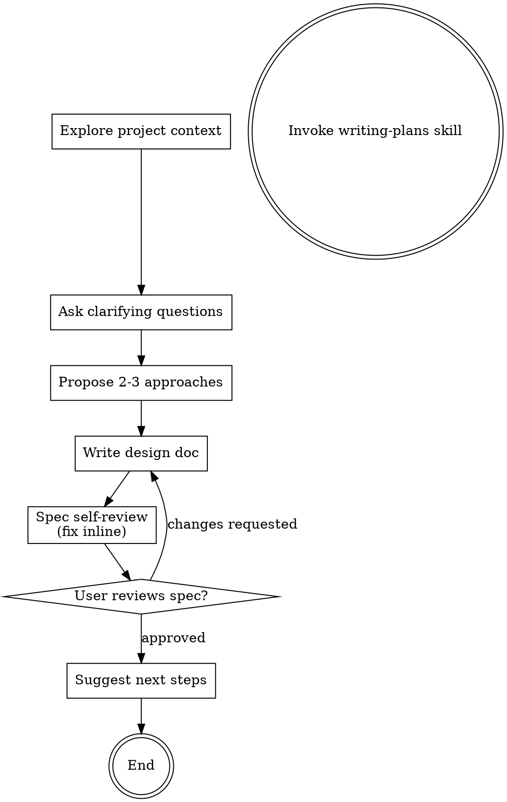

# Brainstorming Ideas Into Designs

Giúp biến ý tưởng thành thiết kế và đặc tả hoàn chỉnh thông qua trao đổi cộng tác tự nhiên.

Bắt đầu bằng việc hiểu ngữ cảnh dự án hiện tại, sau đó đặt câu hỏi từng cái một để tinh chỉnh ý tưởng. Khi đã hiểu rõ những gì cần xây dựng, trình bày thiết kế và xin phê duyệt từ người dùng.

<HARD-GATE>
KHÔNG được invoke bất kỳ skill triển khai nào, viết code, scaffold dự án, hoặc thực hiện bất kỳ hành động triển khai nào cho đến khi đã trình bày thiết kế và người dùng đã phê duyệt. Điều này áp dụng cho MỌI dự án bất kể độ đơn giản.
</HARD-GATE>

<TEMPLATE-COMPLIANCE-GATE>
Khi viết bất kỳ deliverable spec nào, output PHẢI tuân theo cấu trúc package spec đa file 100%.
- Tuân theo [modular-spec-package-template](reference/modular-spec-package-template.md).
- Các file package bắt buộc: `00-index.md`, `01-backend.md`, `02-frontend.md`, `03-behavior.md`, `04-quality.md`.
- Xem package spec là mặc định bắt buộc, không phải định dạng tùy chọn.
- Giữ nguyên mọi section cấp cao nhất, subsection, quy tắc sở hữu file, và thứ tự do template định nghĩa.
- Không đổi tên, gộp, xóa, hoặc sắp xếp lại các section bắt buộc hoặc các file package bắt buộc.
- Điền nội dung section, nhưng không thay đổi skeleton bắt buộc.
Nếu bất kỳ section bắt buộc, file bắt buộc, hoặc quy tắc sở hữu bắt buộc nào bị thiếu, spec được coi là không hợp lệ và phải được sửa trước khi trình bày cho người dùng.
</TEMPLATE-COMPLIANCE-GATE>

## Checklist

BẮT BUỘC tạo task cho mỗi mục và hoàn thành theo thứ tự:

1. **Define type of the requirement** — Xác định yêu cầu là tạo spec mới hay yêu cầu thay đổi. Nếu người dùng đã có source thì không cần hỏi lại. Nếu là change request, phải thêm theo quy tắc **Change Request**.
1. **Explore project context** — kiểm tra files, docs. Không kiểm tra e2e, test
2. **Ask clarifying questions, Combine all the questions and ask them all at once, use #tool:vscode/askQuestions to gather answers** — Hiểu mục đích/ràng buộc/tiêu chí thành công
3. **Propose 2-3 approaches** — đưa ra 2-3 phương án với trade-offs và khuyến nghị của bạn
<!-- 4. **Present design** — trình bày theo sections tỷ lệ với độ phức tạp, xin phê duyệt sau mỗi section -->
4. **Write design doc** — lưu vào `docs/<topic>/specs/<topic>-design/` với `index.md` làm entry point chính thức. Dùng tiếng Việt cho nội dung, giữ headers/section titles tiếng Anh. Tuân theo [modular-spec-package-template](reference/modular-spec-package-template.md) với compliance 100% cấu trúc.
5. **Spec self-review** — kiểm tra nhanh inline xem có placeholders, mâu thuẫn, mơ hồ, scope không (xem bên dưới)
6. **User reviews written spec** — yêu cầu người dùng review spec file trước khi tiếp tục
7. **No code blocks in spec** - Nếu spec cần code snippets, mô tả bằng pseudo code thay vì dùng code blocks.

**Template của `<topic>-design`: (bắt buộc, nghiêm ngặt)**
- File specification PHẢI được định dạng bằng Markdown chuẩn.
- Deliverable specification PHẢI là **package spec 5-file** sử dụng [modular-spec-package-template](reference/modular-spec-package-template.md):
  - `00-index.md` — executive summary, objective & scope, changelog, architecture overview, cross-file links
  - `01-backend.md` — DB schema, DTOs, API endpoints, validation rules, error handling
  - `02-frontend.md` — wireframes, component tree, screen item specs, composable/store, TS types
  - `03-behavior.md` — page events & handlers, UI states, confirm dialogs, navigation flows, sequence diagrams
    <!-- > **Optional**: Đối với các feature có tương tác user-system phức tạp (nhiều actors, alternative flows, exception handling), invoke skill `use-case-writer` trước để tạo UC specs có cấu trúc (định dạng 13-field). Lưu output vào `docs/<topic>/specs/UC-XX_name.md` và reference từ file này. -->
  - `04-quality.md` — per-page UT test cases (Arrange/Act/Assert), backend integration tests, performance, security, accessibility, logging
- Compliance cấu trúc là bắt buộc: thứ bậc section, thứ tự, và sở hữu file/package từ template là bắt buộc và không thể sửa đổi.
- Nếu nội dung cụ thể của dự án không áp dụng được cho một section bắt buộc, giữ section đó và đánh dấu rõ ràng là "Not applicable" kèm lý do ngắn gọn.

## Rule when Change Request
Objective: Duy trì "Single Source of Truth" bằng cách đảm bảo tất cả thay đổi logic hoặc UI được phản ánh trong tài liệu (.md spec) trước khi bất kỳ triển khai code nào.
### Workflow for Handling Change Requests:
1. **Impact Analysis & Conflict Detection:**
- So sánh CR hiện tại với spec .md hiện có.
- Xác định các functions, components, hoặc database schemas bị ảnh hưởng.
- Đánh dấu bất kỳ mâu thuẫn nào giữa CR mới và logic legacy hiện có.
2. **Spec-First Documentation (Traceability):**
- Version Control: Không ghi đè toàn bộ deliverable. Cập nhật Change Log trong `index.md` và sau đó chỉ cập nhật (các) file sở hữu liên quan.
- Contextual Tagging: Sử dụng inline markers trong chi tiết kỹ thuật:
  - [NEW]: Cho các feature hoàn toàn mới.
  - [UPDATE - CR-XXXX]: Cho các logic hiện có đã sửa đổi.
  - [DEPRECATED]: Cho các feature sẽ bị xóa (giữ cho đến khi verify implementation).
- Visual Alignment: Cập nhật bất kỳ Mermaid diagrams nào (Flowcharts/Sequence diagrams) trong (các) file sở hữu để phản ánh business logic mới.
3. **User-Centric Documentation:**
- Tạo block `### Summary of Changes` bằng ngôn ngữ business không kỹ thuật. Trong package spec, giữ block này trong `index.md`.
- Định nghĩa rõ ràng: Những gì đã thay đổi, Tại sao thay đổi, và Ảnh hưởng như thế nào đến data hoặc workflows hiện có.
4. **Implementation & Sync:**
- Chỉ tiến hành refactoring code sau khi spec .md được xác nhận là baseline mới.
- Đảm bảo comments trong source code reference CR cụ thể (ví dụ: // Updated per CR-101).
5. **Change Logging**
- Mỗi CR tạo một entry với: CR ID, tóm tắt ngắn, author, date, và version spec.

## Process Flow

**The terminal state is invoking writing-plans.** Do NOT invoke frontend-design, mcp-builder, or any other implementation skill. The ONLY skill you invoke after brainstorming is writing-plans.

## The Process

**Understanding the idea:**

- Check out trạng thái dự án hiện tại trước (files, docs, recent commits)
- Trước khi đặt câu hỏi chi tiết, đánh giá scope: nếu yêu cầu mô tả nhiều subsystem độc lập (ví dụ: "xây dựng platform với chat, file storage, billing, và analytics"), flag ngay lập tức. Đừng dành câu hỏi để tinh chỉnh chi tiết của một dự án cần được phân rã trước.
- Nếu dự án quá lớn cho một package spec duy nhất, giúp người dùng phân rã thành các sub-project: những piece độc lập nào, chúng liên quan thế nào, thứ tự xây dựng ra sao? Sau đó brainstorm sub-project đầu tiên qua flow thiết kế bình thường. Mỗi sub-project nhận một package spec → plan → implementation cycle riêng.
- Đối với các dự án có scope phù hợp, đặt câu hỏi từng cái một để tinh chỉnh ý tưởng
- Ưu tiên câu hỏi nhiều lựa chọn khi có thể, nhưng câu hỏi mở cũng được
- Chỉ một câu hỏi mỗi message - nếu một chủ đề cần khám phá thêm, chia thành nhiều câu hỏi
- Tập trung hiểu: purpose, constraints, success criteria

**Exploring approaches:**

- Đề xuất 2-3 cách tiếp cận khác nhau với trade-offs
- Trình bày các lựa chọn một cách trò chuyện với khuyến nghị và lý do của bạn
- Dẫn đầu với lựa chọn được khuyến nghị và giải thích tại sao

**Design for isolation and clarity:**

- Chia hệ thống thành các units nhỏ hơn mà mỗi unit có một mục đích rõ ràng, giao tiếp qua các interfaces được định nghĩa tốt, và có thể được hiểu và test độc lập
- Với mỗi unit, bạn nên có thể trả lời: nó làm gì, cách sử dụng nó, và nó phụ thuộc vào gì?
- Ai đó có thể hiểu một unit làm gì mà không cần đọc nội bộ của nó không? Bạn có thể thay đổi nội bộ mà không phá vỡ consumers không? Nếu không, các boundaries cần work.
- Các units nhỏ, well-bounded cũng dễ làm việc hơn - bạn reasoning tốt hơn về code bạn có thể giữ trong context cùng một lúc, và các edits của bạn đáng tin cậy hơn khi files tập trung. Khi một file phát triển lớn, đó thường là dấu hiệu nó đang làm quá nhiều.

**Working in existing codebases:**

- Explore cấu trúc hiện tại trước khi đề xuất thay đổi. Follow các patterns hiện có.
- Khi existing code có problems ảnh hưởng đến work (ví dụ: file đã phát triển quá lớn, boundaries không rõ ràng, responsibilities rối), bao gồm các improvements có mục tiêu như một phần của design - cách một developer giỏi cải thiện code họ đang làm việc.
- Không đề xuất refactoring không liên quan. Stay focused vào những gì phục vụ mục tiêu hiện tại.

## After the Design

**Documentation:**

- Write validated design vào `docs/<topic>/specs/<topic>-design/index.md` cùng với các file concern bắt buộc từ modular template.
  - (User preferences for spec location override this default)

**Spec Checklist:**
Sau khi viết spec document, nhìn lại với con mắt tươi mới:

1. **Placeholder scan:** Có bất kỳ "TBD", "TODO", sections chưa hoàn thành, hoặc requirements mơ hồ không? Sửa chúng.
2. **Internal consistency:** Có sections nào mâu thuẫn với nhau không? Architecture có khớp với các mô tả feature không?
3. **Scope check:** Đây có phải là focused đủ cho một implementation plan duy nhất, hay cần decomposition?
4. **Ambiguity check:** Có bất kỳ requirement nào có thể được hiểu theo hai cách khác nhau không? Nếu vậy, chọn một và làm rõ.
5. **Template compliance check (bắt buộc):** Verify 100% sự hiện diện của section/subsection, bộ file bắt buộc, ownership, và ordering theo [modular-spec-package-template](reference/modular-spec-package-template.md). Nếu có bất kỳ mismatch nào, sửa trước khi user review.

Sửa bất kỳ issues nào inline. Không cần review lại — chỉ sửa và tiếp tục.

**User Review Gate:**
Sau khi spec review loop vượt qua, yêu cầu người dùng review package spec đã viết trước khi tiếp tục:

> "Spec package written and committed to `<path>/index.md`. Please review the entry file first, then the concern files it references, and let me know if you want any changes before we start writing out the implementation plan."

Chờ phản hồi của người dùng. Nếu họ yêu cầu thay đổi, thực hiện và chạy lại spec review loop. Chỉ tiếp tục sau khi người dùng phê duyệt.

**Implementation:**
Invoke skill `writing-plans` để tạo detailed implementation plan. KHÔNG invoke bất kỳ skill nào khác — `writing-plans` là bước tiếp theo và duy nhất sau khi user approves spec.

## Key Principles
- **Multiple choice preferred** - Dễ trả lời hơn open-ended khi có thể
- **YAGNI ruthlessly** - Loại bỏ các features không cần thiết khỏi tất cả designs
- **Explore alternatives** - Luôn đề xuất 2-3 approaches trước khi settle
- **Incremental validation** - Trình bày design, nhận approval trước khi tiếp tục
- **Be flexible** - Quay lại làm rõ khi có gì đó không hợp lý