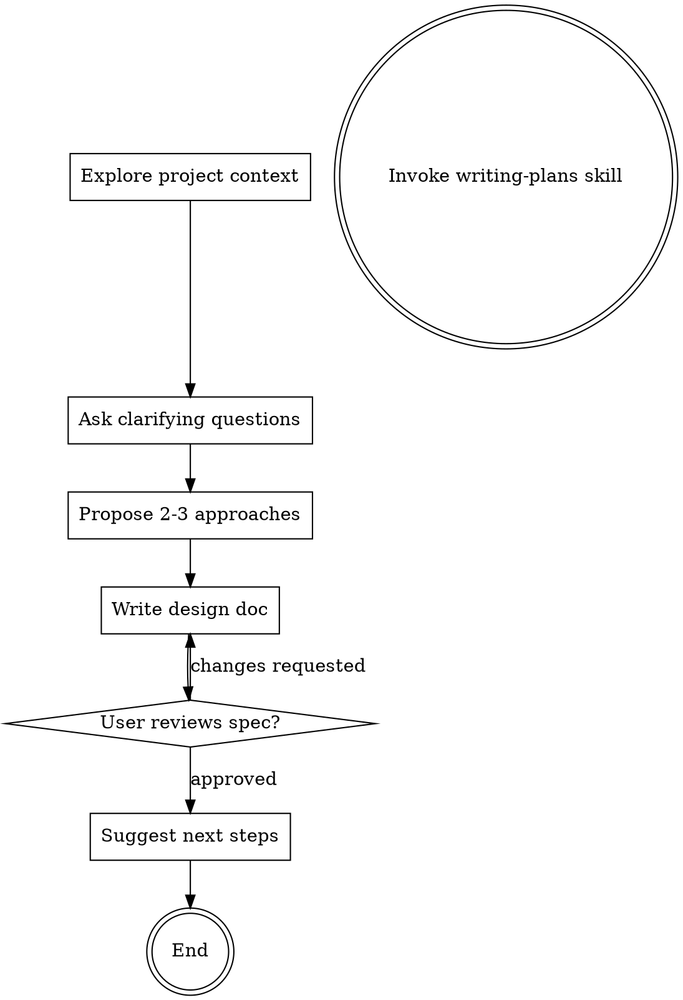

# Brainstorming Ideas Into Designs

Help turn ideas into fully formed designs and specs through natural collaborative dialogue.

Start by understanding the current project context, then ask questions one at a time to refine the idea. Once you understand what you're building, present the design and get user approval.

<HARD-GATE>
Do NOT invoke any implementation skill, write any code, scaffold any project, or take any implementation action until you have presented a design and the user has approved it. This applies to EVERY project regardless of perceived simplicity.
</HARD-GATE>

<TEMPLATE-COMPLIANCE-GATE>
When writing any spec deliverable, the output MUST follow the multi-file spec package structure 100%.
- Follow [modular-spec-package-template](reference/modular-spec-package-template.md).
- Required package files: `00-index.md`, `01-backend.md`, `02-frontend.md`, `03-behavior.md`, `04-quality.md`.
- Treat the spec package as the required default, not an optional format.
- Keep every required top-level section, subsection, file ownership rule, and ordering defined by the template.
- Do not rename, merge, remove, or reorder required sections or required package files.
- Fill section content, but do not alter the required skeleton.
If any required section, required file, or required ownership rule is missing, the spec is considered invalid and must be corrected before presenting to the user.
</TEMPLATE-COMPLIANCE-GATE>

## Checklist

You MUST create a task for each of these items and complete them in order:

1. **Define type of the requirement** — Determine if the requirement is to create a new specification or to request a change. If the user already has a source, there's no need to ask again. If it's a change request, it must be added according to rule **Change Request**.
1. **Explore project context** — check files, docs. Do not check e2e, test
2. **Ask clarifying questions, Combine all the questions and ask them all at once, use #tool:vscode/askQuestions to gather answers** — Understand purpose/constraints/success criteria
3. **Propose 2-3 approaches** — with trade-offs and your recommendation
<!-- 4. **Present design** — in sections scaled to their complexity, get user approval after each section -->
4. **Write design doc** — save to `docs/<topic>/specs/<topic>-design/` with `index.md` as the canonical entry point. Use Vietnamese for the content, while keeping the headers/section titles in English. Follow [modular-spec-package-template](reference/modular-spec-package-template.md) with 100% structural compliance.
<!-- 6. **Spec self-review** — quick inline check for placeholders, contradictions, ambiguity, scope (see below) -->
5. **User reviews written spec** — ask user to review the spec file before proceeding
6. **Transition to implementation** — invoke writing-plans skill to create implementation plan

**Template of `<topic>-design`: (mandatory, strict)**
- The specification file must be formatted in well formed Markdown.
- The specification deliverable must be a **5-file spec package** using [modular-spec-package-template](reference/modular-spec-package-template.md):
  - `00-index.md` — executive summary, objective & scope, changelog, architecture overview, cross-file links
  - `01-backend.md` — DB schema, DTOs, API endpoints, validation rules, error handling
  - `02-frontend.md` — wireframes, component tree, screen item specs, composable/store, TS types
  - `03-behavior.md` — page events & handlers, UI states, confirm dialogs, navigation flows, sequence diagrams
    <!-- > **Optional**: For features with complex user-system interactions (multiple actors, alternative flows, exception handling), invoke `use-case-writer` skill first to generate structured UC specs (13-field format). Save output to `docs/<topic>/specs/UC-XX_name.md` and reference from this file. -->
  - `04-quality.md` — per-page UT test cases (Arrange/Act/Assert), backend integration tests, performance, security, accessibility, logging
- Structural compliance is mandatory: section hierarchy, ordering, and package/file ownership from the template are required and cannot be modified.
- If project-specific content does not apply to a required section, keep that section and explicitly mark it as "Not applicable" with a short reason.

## Rule when Change Request
Objective: Maintain a "Single Source of Truth" by ensuring all logic or UI changes are reflected in the documentation (.md spec) before any code implementation.
### Workflow for Handling Change Requests:
1. **Impact Analysis & Conflict Detection:**
- Compare the incoming CR against the existing .md specification.
- Identify affected functions, components, or database schemas.
- Flag any contradictions between the new CR and existing legacy logic.
2. **Spec-First Documentation (Traceability):**
- Version Control: Do not overwrite the entire deliverable. Update the Change Log in `index.md` and then update only the owning concern file(s).
- Contextual Tagging: Use inline markers within the technical details:
  - [NEW]: For entirely new features.
  - [UPDATE - CR-XXXX]: For modified existing logic.
  - [DEPRECATED]: For features to be removed (keep until implementation is verified).
- Visual Alignment: Update any Mermaid diagrams (Flowcharts/Sequence diagrams) in the owning file(s) to reflect the new business logic visually.
3. **User-Centric Documentation:**
- Generate a `### Summary of Changes` block using non-technical business language. In a spec package, keep this in `index.md`.
- Clearly define: What changed, Why it changed, and How it affects existing data or user workflows.
4. **Implementation & Sync:**
- Proceed to code refactoring only after the .md spec is confirmed as the new baseline.
- Ensure source code comments reference the specific CR (e.g., // Updated per CR-101).
5. **Change Logging**
- Each CR creates an entry with: CR ID, brief summary, author, date, and spec version.

## Process Flow

**The terminal state is invoking writing-plans.** Do NOT invoke frontend-design, mcp-builder, or any other implementation skill. The ONLY skill you invoke after brainstorming is writing-plans.

## The Process

**Understanding the idea:**

- Check out the current project state first (files, docs, recent commits)
- Before asking detailed questions, assess scope: if the request describes multiple independent subsystems (e.g., "build a platform with chat, file storage, billing, and analytics"), flag this immediately. Don't spend questions refining details of a project that needs to be decomposed first.
- If the project is too large for a single spec package, help the user decompose into sub-projects: what are the independent pieces, how do they relate, what order should they be built? Then brainstorm the first sub-project through the normal design flow. Each sub-project gets its own spec package → plan → implementation cycle.
- For appropriately-scoped projects, ask questions one at a time to refine the idea
- Prefer multiple choice questions when possible, but open-ended is fine too
- Only one question per message - if a topic needs more exploration, break it into multiple questions
- Focus on understanding: purpose, constraints, success criteria

**Exploring approaches:**

- Propose 2-3 different approaches with trade-offs
- Present options conversationally with your recommendation and reasoning
- Lead with your recommended option and explain why

**Design for isolation and clarity:**

- Break the system into smaller units that each have one clear purpose, communicate through well-defined interfaces, and can be understood and tested independently
- For each unit, you should be able to answer: what does it do, how do you use it, and what does it depend on?
- Can someone understand what a unit does without reading its internals? Can you change the internals without breaking consumers? If not, the boundaries need work.
- Smaller, well-bounded units are also easier for you to work with - you reason better about code you can hold in context at once, and your edits are more reliable when files are focused. When a file grows large, that's often a signal that it's doing too much.

**Working in existing codebases:**

- Explore the current structure before proposing changes. Follow existing patterns.
- Where existing code has problems that affect the work (e.g., a file that's grown too large, unclear boundaries, tangled responsibilities), include targeted improvements as part of the design - the way a good developer improves code they're working in.
- Don't propose unrelated refactoring. Stay focused on what serves the current goal.

## After the Design

**Documentation:**

- Write the validated design to `docs/<topic>/specs/<topic>-design/index.md` plus the required concern files from the modular template.
  - (User preferences for spec location override this default)
- Use elements-of-style:writing-clearly-and-concisely skill if available
- Commit the design document to git

**Spec Checklist:**
After writing the spec document, look at it with fresh eyes:

1. **Placeholder scan:** Any "TBD", "TODO", incomplete sections, or vague requirements? Fix them.
2. **Internal consistency:** Do any sections contradict each other? Does the architecture match the feature descriptions?
3. **Scope check:** Is this focused enough for a single implementation plan, or does it need decomposition?
4. **Ambiguity check:** Could any requirement be interpreted two different ways? If so, pick one and make it explicit.
5. **Template compliance check (mandatory):** Verify 100% section/subsection presence, required file set, ownership, and ordering against [modular-spec-package-template](reference/modular-spec-package-template.md). If any mismatch exists, fix before user review.

Fix any issues inline. No need to re-review — just fix and move on.

**User Review Gate:**
After the spec review loop passes, ask the user to review the written spec package before proceeding:

> "Spec package written and committed to `<path>/index.md`. Please review the entry file first, then the concern files it references, and let me know if you want any changes before we start writing out the implementation plan."

Wait for the user's response. If they request changes, make them and re-run the spec review loop. Only proceed once the user approves.

**Implementation:**
Invoke the `writing-plans` skill to create a detailed implementation plan. Do NOT invoke any other skill — `writing-plans` is the next and only step after user approves the spec.

## Key Principles
- **Multiple choice preferred** - Easier to answer than open-ended when possible
- **YAGNI ruthlessly** - Remove unnecessary features from all designs
- **Explore alternatives** - Always propose 2-3 approaches before settling
- **Incremental validation** - Present design, get approval before moving on
- **Be flexible** - Go back and clarify when something doesn't make sense