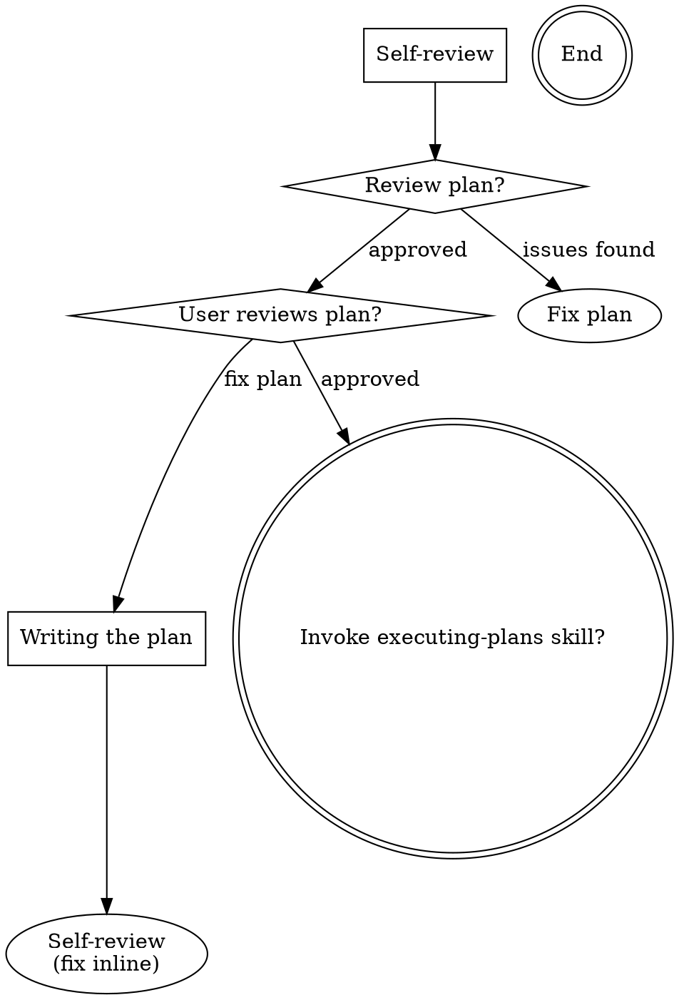

--- 
name: writing-plans
description: Use when you have a spec or requirements for a multi-step task, before touching code 
--- 

# Writing Plans 
## Overview
Write comprehensive implementation plans assuming the engineer has zero context for our codebase and questionable taste. Document everything they need to know: which files to touch for each task, code, testing, docs they might need to check, how to test it. Give them the whole plan as bite-sized tasks. DRY. YAGNI. TDD. Frequent commits.

Plans must be execution-ready for the `executing-plans` skill. When a plan has multiple tasks, task boundaries must be explicit enough that independent tasks can be dispatched to subagents in parallel.

Assume they are a skilled developer, but know almost nothing about our toolset or problem domain. Assume they don't know good test design very well.

**Announce at start:** "I'm using the writing-plans skill to create the implementation plan."

**Context:** Prefer a dedicated worktree when the user or workflow provides one. If not, write the plan for the current workspace without assuming worktree-only setup. 

**Save plans to:** docs/<topic>/plans/YYYY-MM-DD-<topic>.md - (User preferences for plan location override this default) 

## Scope Check

If the spec covers multiple independent subsystems, it should have been broken into sub-project specs during brainstorming. If it wasn't, suggest breaking this into separate plans — one per subsystem. Each plan should produce working, testable software on its own.

## File Structure

Before defining tasks, map out which files will be created or modified and what each one is responsible for. This is where decomposition decisions get locked in.

- Design units with clear boundaries and well-defined interfaces. Each file should have one clear responsibility.
- You reason best about code you can hold in context at once, and your edits are more reliable when files are focused. Prefer smaller, focused files over large ones that do too much.
- Files that change together should live together. Split by responsibility, not by technical layer.
- In existing codebases, follow established patterns. If the codebase uses large files, don't unilaterally restructure - but if a file you're modifying has grown unwieldy, including a split in the plan is reasonable.

This structure informs the task decomposition. Each task should produce self-contained changes that make sense independently.

## Parallel-Ready Task Design

Plans are not only documentation artifacts. They are execution inputs.

- Decompose tasks so unrelated work can run in parallel.
- Make dependencies explicit. If Task 3 depends on Task 1, say so directly.
- Avoid plans where every task implicitly depends on the previous one unless that is genuinely required.
- Prefer vertical slices with clear ownership over broad phase buckets like "frontend", "backend", "testing" when those buckets force unnecessary serialization.
- If multiple tasks touch the same files heavily, either merge them into one task lane or redesign the plan to reduce conflict.
- If a plan has only one meaningful task, keep it as one task. Do not split artificially just to create parallelism.

Before finalizing the plan, ask: "Could an executing agent safely dispatch 2 or more tasks in parallel without constant integration conflicts?" If not, refine the task boundaries.

## Planning Principles (NOT Fixed Task Templates!)
> 🔴 **No fixed task count or canned phase structure. Each plan is unique to the task.**
### Principle 1: Keep It SHORT
| ❌ Wrong | ✅ Right |
|----------|----------|
| 50 tasks with sub-tasks | 5-10 clear tasks max |
| Every micro-step listed | Only actionable items |
| Verbose descriptions | One-line per task. Keep the task description concise and high-level; do not include any code within the task description. |

### Principle 2: Be SPECIFIC, Not Generic
| ❌ Wrong | ✅ Right |
|----------|----------|
| "Set up project" | "Run npx create-next-app" |
| "Add authentication" | "Install next-auth, create /api/auth/[...nextauth].ts" |
| "Style the UI" | "Add Tailwind classes to Header.tsx" |

> **Rule:** Each task should have a clear, verifiable outcome.

### Principle 3: Dynamic Content Based on Project Type

**For NEW PROJECT:**
- What tech stack? (decide first)
- What's the MVP? (minimal features)
- What's the file structure?

**For FEATURE ADDITION:**
- Which files are affected?
- What dependencies needed?
- How to verify it works?

**For BUG FIX:**
- What's the root cause?
- What file/line to change?
- How to test the fix?

### Principle 4: Scripts Are Project-Specific
> 🔴 **DO NOT copy-paste script commands. Choose based on project type.**
| Project Type | Relevant Scripts |
|--------------|------------------|
| Frontend/React | ux_audit.py, accessibility_checker.py |
| Backend/API | api_validator.py, security_scan.py |
| Mobile | mobile_audit.py |
| Database | schema_validator.py |
| Full-stack | Mix of above based on what you touched |

**Wrong:** Adding all scripts to every plan
**Right:** Only scripts relevant to THIS task

### Principle 5: Verification is Simple
| ❌ Wrong | ✅ Right |
|----------|----------|
| "Verify the component works correctly" | "Run npm run dev, click button, see toast" |
| "Test the API" | "curl localhost:3000/api/users returns 200" |
| "Check styles" | "Open browser, verify dark mode toggle works" |

### Principle 6: Tasks Must Be Parallelizable When Possible
| ❌ Wrong | ✅ Right |
|----------|----------|
| "Task 1: Backend, Task 2: Frontend, Task 3: Tests" | "Task 1: Add shared contract, Task 2: Build list API, Task 3: Build independent filter UI" |
| Hidden dependencies between all tasks | Explicit `Depends on:` only where truly required |
| Two tasks editing the same central file heavily | One task lane or a cleaner decomposition |

> **Rule:** If the plan has multiple tasks, assume `executing-plans` will try to run independent tasks in parallel. Write the plan to make that safe.

## Plan Document Header
**Every plan MUST start with this header:**

```markdown
# [Feature Name] Implementation Plan 
> **For agentic workers:** REQUIRED SUB-SKILL: Use skill executing-plans to implement this plan. Steps use checkbox (`- [ ]`) syntax for tracking.
> **Execution mode:** If this plan has 2 or more independent tasks, execute them in parallel with subagents. If it has only 1 task, direct execution is acceptable.
**Goal:** [One sentence describing what this builds]
**Architecture:** [2-3 sentences about approach]
**Tech Stack:** [Key technologies/libraries]

## Execution Lanes

- Lane 1: [Task numbers that can run together]
- Lane 2: [Task numbers that depend on Lane 1 or are otherwise grouped]

---
```

If the plan has only 1 task, `Execution Lanes` may be omitted.

## Task Structure
````markdown
### Task N: [Component Name]

**Depends on:** [Task N, if required] or `None`

**Files:**
- Create: `exact/path/to/file.py`
- Modify: `exact/path/to/existing.py:123-145`
- Test: `tests/exact/path/to/test.py`

- [ ] **Step 1: Write the failing test**

```python
def test_specific_behavior():
    result = function(input)
    assert result == expected
```

- [ ] **Step 2: Run test to verify it fails**

Run: `pytest tests/path/test.py::test_name -v`
Expected: FAIL with "function not defined"

- [ ] **Step 3: Write minimal implementation**

```python
def function(input):
    return expected
```

- [ ] **Step 4: Run test to verify it passes**

Run: `pytest tests/path/test.py::test_name -v`
Expected: PASS

- [ ] **Step 5: Commit**

```bash
git add tests/path/test.py src/path/file.py
git commit -m "feat: add specific feature"
```
**Effort Total (hours):** Estimated time required for an experienced developer to analyze, implement, and complete all tasks entirely manually, without any AI assistance.

````

## REMEMBER
- Task following TDD principles: write failing test, verify it fails, implement, verify it passes, commit.
- Follow the pseudo-code strictly; don't add extra steps or skip steps. Do not write detailed implementation code in the plan - only concise pseudo-code. The executor writes the actual code.
- Exact commands with expected output
- Make dependencies explicit so execution can be parallelized safely
- DRY, YAGNI, frequent commits 

## Self-Review
After writing the complete plan, look at the spec with fresh eyes and check the plan against it. This is a checklist you run yourself — not a subagent dispatch.

**1. Spec coverage:** Skim each section/requirement in the spec. Can you point to a task that implements it? List any gaps.

**2. Placeholder scan:** Search your plan for red flags — any of the patterns from the "No Placeholders" section above. Fix them.

**3. Type consistency:** Do the types, method signatures, and property names you used in later tasks match what you defined in earlier tasks? A function called clearLayers() in Task 3 but clearFullLayers() in Task 7 is a bug. If you find issues, fix them inline. No need to re-review — just fix and move on. If you find a spec requirement with no task, add the task. 

**4. Parallel execution check:** If the plan has multiple tasks, can independent tasks be run by subagents without hidden file conflicts, hidden ordering assumptions, or missing dependency notes? If not, rewrite the task boundaries before finalizing the plan.

**5. Workflow consistency check:** Does the plan assume tools, branches, worktrees, or setup steps that are not actually required by the current workflow? If yes, rewrite those assumptions so the executor can act without guesswork.

## Process Flow
