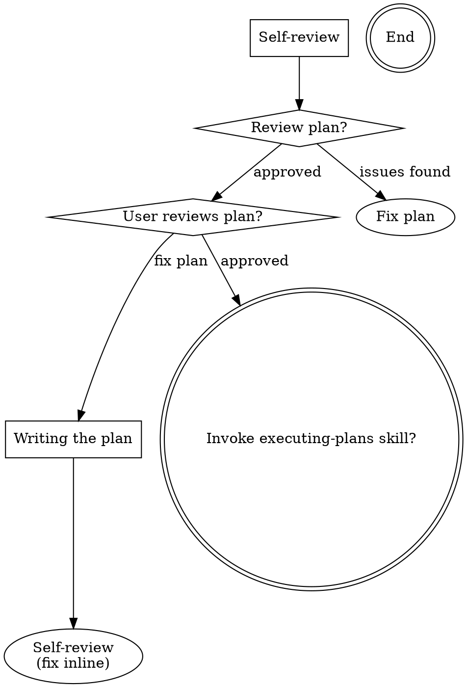

--- 
name: writing-plans
description: Use when you have a spec or requirements for a multi-step task, before touching code 
--- 

# Writing Plans 
## Overview
Write comprehensive implementation plans assuming the engineer has zero context for our codebase and questionable taste. Document everything they need to know: which files to touch for each task, code, testing, docs they might need to check, how to test it. Give them the whole plan as bite-sized tasks. DRY. YAGNI. TDD. Frequent commits.

Assume they are a skilled developer, but know almost nothing about our toolset or problem domain. Assume they don't know good test design very well.

**Announce at start:** "I'm using the writing-plans skill to create the implementation plan."

**Context:** This should be run in a dedicated worktree (created by brainstorming skill). 

**Save plans to:** docs/<topic>/plans/YYYY-MM-DD-<topic>.md - (User preferences for plan location override this default) 

## Scope Check

If the spec covers multiple independent subsystems, it should have been broken into sub-project specs during brainstorming. If it wasn't, suggest breaking this into separate plans — one per subsystem. Each plan should produce working, testable software on its own.

## File Structure

Before defining tasks, map out which files will be created or modified and what each one is responsible for. This is where decomposition decisions get locked in.

- Design units with clear boundaries and well-defined interfaces. Each file should have one clear responsibility.
- You reason best about code you can hold in context at once, and your edits are more reliable when files are focused. Prefer smaller, focused files over large ones that do too much.
- Files that change together should live together. Split by responsibility, not by technical layer.
- In existing codebases, follow established patterns. If the codebase uses large files, don't unilaterally restructure - but if a file you're modifying has grown unwieldy, including a split in the plan is reasonable.

This structure informs the task decomposition. Each task should produce self-contained changes that make sense independently.

## Planning Principles (NOT Templates!)
> 🔴 **NO fixed templates. Each plan is UNIQUE to the task.**
### Principle 1: Keep It SHORT
| ❌ Wrong | ✅ Right |
|----------|----------|
| 50 tasks with sub-tasks | 5-10 clear tasks max |
| Every micro-step listed | Only actionable items |
| Verbose descriptions | One-line per task. Keep the task description concise and high-level; do not include any code within the task description. |

### Principle 2: Be SPECIFIC, Not Generic
| ❌ Wrong | ✅ Right |
|----------|----------|
| "Set up project" | "Run npx create-next-app" |
| "Add authentication" | "Install next-auth, create /api/auth/[...nextauth].ts" |
| "Style the UI" | "Add Tailwind classes to Header.tsx" |

> **Rule:** Each task should have a clear, verifiable outcome.

### Principle 3: Dynamic Content Based on Project Type

**For NEW PROJECT:**
- What tech stack? (decide first)
- What's the MVP? (minimal features)
- What's the file structure?

**For FEATURE ADDITION:**
- Which files are affected?
- What dependencies needed?
- How to verify it works?

**For BUG FIX:**
- What's the root cause?
- What file/line to change?
- How to test the fix?

### Principle 4: Scripts Are Project-Specific
> 🔴 **DO NOT copy-paste script commands. Choose based on project type.**
| Project Type | Relevant Scripts | |--------------|------------------|
| Frontend/React | ux_audit.py, accessibility_checker.py |
| Backend/API | api_validator.py, security_scan.py |
| Mobile | mobile_audit.py |
| Database | schema_validator.py |
| Full-stack | Mix of above based on what you touched |

**Wrong:** Adding all scripts to every plan
**Right:** Only scripts relevant to THIS task

### Principle 5: Verification is Simple
| ❌ Wrong | ✅ Right |
|----------|----------|
| "Verify the component works correctly" | "Run npm run dev, click button, see toast" |
| "Test the API" | "curl localhost:3000/api/users returns 200" |
| "Check styles" | "Open browser, verify dark mode toggle works" |

## Plan Document Header
**Every plan MUST start with this header:**

```markdown
# [Feature Name] Implementation Plan 
> **For agentic workers:** REQUIRED SUB-SKILL: Use skill executing-plans to implement this plan. Steps use checkbox (`- [ ]`) syntax for tracking.
**Goal:** [One sentence describing what this builds]
**Architecture:** [2-3 sentences about approach]
**Tech Stack:** [Key technologies/libraries]

---
```

## Task Structure
````markdown
### Task N: [Component Name]

**Effort (hours):** Estimated time required for an experienced developer to analyze, implement, and complete the task entirely manually, without any AI assistance.

**Files:**
- Create: `exact/path/to/file.py`
- Modify: `exact/path/to/existing.py:123-145`
- Test: `tests/exact/path/to/test.py`

**Use Skills:**
- [ ] `ttd.md`  for test-driven development
- [ ] `code-review.md` for self-review after implementation

**Implementation**:
```ts 
// Pseudo-code from specs. Do not write detailed implementation code in the plan - only concise pseudo-code. (The executor will write the actual code based on the pseudo-code.)
```

**Verification:**
- [ ] Run `npm test` and ensure all tests pass

**Commit**
```bash 
git add tests/path/test.py src/path/file.py
git commit -m "feat: add specific feature"
```

**Effort Total (hours):** Estimated time required for an experienced developer to analyze, implement, and complete all tasks entirely manually, without any AI assistance.

````

## No Placeholders
Every step must contain the actual content an engineer needs. These are **plan failures** — never write them:
- "TBD", "TODO", "implement later", "fill in details"
- "Add appropriate error handling" / "add validation" / "handle edge cases"
- "Write tests for the above" (without actual test code)
- "Similar to Task N" (repeat the code — the engineer may be reading tasks out of order)
- Steps that describe what to do without showing how (code blocks required for code steps)
- References to types, functions, or methods not defined in any task 

## REMEMBER
- Exact file paths always
- Follow the pseudo-code strictly; don't add extra steps or skip steps. DONT WRITE DETAILED IMPLEMENTATION CODE IN THE PLAN - only concise pseudo-code. (The executor will write the actual code based on the pseudo-code.)
- Exact commands with expected output
- DRY, YAGNI, TDD, frequent commits 

## Self-Review
After writing the complete plan, look at the spec with fresh eyes and check the plan against it. This is a checklist you run yourself — not a subagent dispatch.

**1. Spec coverage:** Skim each section/requirement in the spec. Can you point to a task that implements it? List any gaps.

**2. Placeholder scan:** Search your plan for red flags — any of the patterns from the "No Placeholders" section above. Fix them.

**3. Type consistency:** Do the types, method signatures, and property names you used in later tasks match what you defined in earlier tasks? A function called clearLayers() in Task 3 but clearFullLayers() in Task 7 is a bug. If you find issues, fix them inline. No need to re-review — just fix and move on. If you find a spec requirement with no task, add the task. 

## Process Flow
