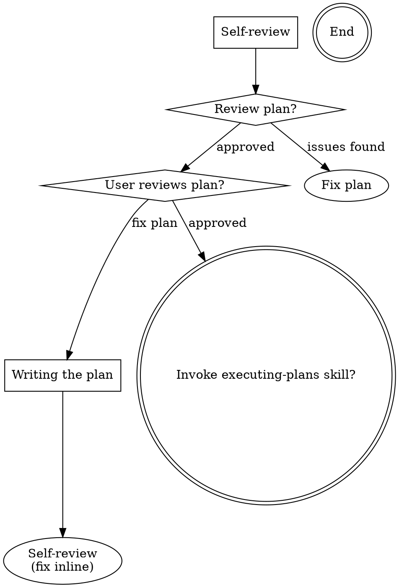

--- 
name: writing-plans
description: Use when you have a spec or requirements for a multi-step task, before touching code 
--- 

# Writing Plans 

**Save plans to:** `docs/<topic>/plans/YYYY-MM-DD-<topic>.md`

## Overview

Write execution-ready plans for the `executing-plans` skill. Audience: skilled developers with no context on our codebase or problem domain. DRY. YAGNI. TDD. Frequent commits.

With coding tasks, follow TDD order when possible: write a failing test that references the spec, implement just enough to make it pass, verify the test passes, then commit. For non-coding tasks (e.g., schema migrations, config changes), TDD is not required.

## Scope Check

If the spec covers multiple independent subsystems, split into separate plans — one per subsystem. Each plan must produce working, testable software on its own.

## Phase Structure

Organize tasks into **Phases**. Phases are sequential — each phase starts only after the previous phase completes. Tasks within a phase are also executed sequentially.

Rules:
- Group related tasks that logically belong together into the same phase.
- Start a new phase only when tasks depend on output from the previous phase.
- If the plan has only one phase, use a single `## Phase 1 — [Name]` heading with tasks nested under it.

## File Structure

Before defining tasks, map out which files will be created or modified and what each one is responsible for. This is where decomposition decisions get locked in.

- Design units with clear boundaries and well-defined interfaces. Each file should have one clear responsibility.
- You reason best about code you can hold in context at once, and your edits are more reliable when files are focused. Prefer smaller, focused files over large ones that do too much.
- Files that change together should live together. Split by responsibility, not by technical layer.
- In existing codebases, follow established patterns. If the codebase uses large files, don't unilaterally restructure - but if a file you're modifying has grown unwieldy, including a split in the plan is reasonable.

This structure informs the task decomposition. Each task should produce self-contained changes that make sense independently.

## Planning Principles (NOT Fixed Task Templates!)
> **No fixed task count or canned phase structure. Each plan is unique to the task.**

### Principle 1: Keep It SHORT
- 5-10 clear tasks max
- Only actionable items
- Keep the task description concise and high-level; do not include any code within the task description.
- Each task should have a clear, verifiable outcome.

### Principle 2: Dynamic Content Based on Project Type

**For NEW PROJECT:**
- What tech stack? (decide first)
- What's the MVP? (minimal features)
- What's the file structure?

**For FEATURE ADDITION:**
- Which files are affected?
- What dependencies needed?
- How to verify it works?

**For BUG FIX:**
- What's the root cause?
- What file/line to change?
- How to test the fix?

### Principle 3: Reference the Design Spec in Every Task
> **Every implementation task must trace directly to its spec source. Never implement from memory or assumption.**
- Implement per `01-backend.md` — SV-002"
- Build `[ListPage]` per `02-frontend.md` — Section 3.1
- Write unit tests per `04-quality.md` — [CreatePage] Unit Tests table
- Handle form validation per rules in `01-backend.md` — Section 3. Validation Rules

> **Rule:** Each task must include a `**Spec Reference:**` field linking to the exact spec file and section. An executor who has never seen the feature must be able to open the spec and know exactly what to build.

### Principle 4: Tests are embedded in tasks, not deferred
- Tests live in the same task as the code they test. Never defer tests to a later phase or separate task.
- For tasks that implement logic, prefer TDD order (write failing test from `04-quality.md` → implement → verify PASS) when applicable.
- TDD is **not required** for every task — schema migrations, config changes, type-only files, and routing setup do not need a failing-test step.
- **Do NOT create a dedicated "Quality" or "Testing" phase.**

### Principle 5: Tasks Must Be Phase-Organized
- Phase 1: DB schema. Phase 2: Backend API + Frontend store. Phase 3: List page + Create page + Edit page.
- Group related tasks that belong to the same phase together.
- Start a new phase only when tasks require output from the previous phase.

### Principle 6: No Placeholders or Vague Language
- No `[TODO]`, `TBD`, vague paths (`path/to/file.ts`), or steps with no verifiable outcome. Every command must have an expected result.
> **Rule:** If a step requires the executor to ask a question before acting, it must be rewritten.

## Plan Document Header
**Every plan MUST start with this header:**

````markdown
# [Feature Name] Implementation Plan
> **For agentic workers:** REQUIRED SUB-SKILL: Use skill `executing-plans` to implement this plan.
> **Execution mode:** Phases are sequential. Tasks within a phase are executed sequentially.

**Goal:** [One sentence describing what this builds]
**Tech Stack:** [Key technologies/libraries]


## Plan Structure
````markdown
## Phase 1 — [Name]
### Task N: [Task Name]

**Spec Reference:** `docs/<topic>/specs/<topic>-design/01-backend.md — Section X.Y`

**Files:**
- Create: `exact/path/to/file.ts`
- Modify: `exact/path/to/existing.ts`
- Test: `exact/path/to/test.spec.ts` _(omit if no tests in this task)_

- [ ] **Step 1:** [Describe what to do — e.g., run migration, implement endpoint, write tests]
  - Run: `[command]`
  - Expected: [verifiable outcome]

- [ ] **Step 2:** ...

- [ ] **Step 3: Commit**
  - `git add [files]`
  - `git commit -m "feat: [description]"`

````

> Steps are free-form — use as many as the task needs. For tasks that write code, prefer TDD order (failing test → implement → verify PASS) when applicable, but it is not mandatory for every task (e.g., schema migrations, config changes, type-only files).

## Planning Principles

**1. Keep it short** — 5–10 tasks max. Concise descriptions, no code in task body. Each task has a clear, verifiable outcome.

**2. Spec reference in every task** — link to exact spec file + section. Executor must be able to open the spec and know exactly what to build without asking questions.

**3. Tests are embedded in tasks** — tests live in the same task as the code they test; never defer to a later phase. For logic-heavy tasks, prefer TDD order (write failing test → implement → verify PASS). Not required for migrations, config, or type-only tasks.

**4. Phases are sequential, tasks within a phase are also sequential** — group related tasks in the same phase. Start a new phase only when the next group of tasks depends on the previous phase's output.

**5. No placeholders** — no `[TODO]`, `TBD`, vague paths (`path/to/file.ts`), or steps with no verifiable outcome. Every command must have an expected result.

## Self-Review (run before saving)

1. **Spec coverage** — every spec requirement maps to a task. Add missing tasks.
2. **Placeholder scan** — no vague paths, missing commands, or unverifiable outcomes.
3. **Type consistency** — types and method names match across all tasks.
4. **Dependency check** — tasks that depend on prior phase output are in a later phase.
5. **Test coverage check** — every task that writes logic includes tests in the same task. No task defers tests to a later phase. Tasks with no logic (migrations, config, type files) may omit tests.

## Process Flow


## After User Approves

Invoke the `executing-plans` skill. Do NOT write code directly.