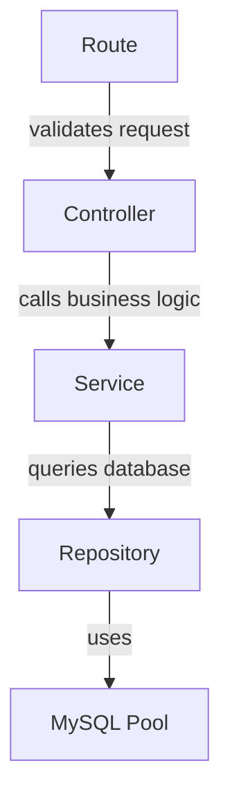

# Project Structure Specification

**Stack**: Vue.js 3 · Express.js · MySQL · TypeScript · PrimeVue · Vite  
**Architecture**: Monorepo · Page-based Frontend · Layered Backend

---

## 1. Monorepo Layout

```
project-root/
├── client/                  # Vue.js frontend (Vite)
├── server/                  # Express.js backend
├── database/                # SQL migrations & seeds
├── .env.example             # Environment variable template
├── .env                     # Local environment variables (git-ignored)
├── .gitignore
├── tsconfig.base.json       # Shared TypeScript config
└── README.md
```

---

## 2. Frontend (`client/`)

### 2.1 Directory Structure

```
client/
├── public/
│   └── favicon.ico
├── src/
│   ├── app/                      # App shell & global setup
│   │   ├── App.vue               # Root component
│   │   ├── main.ts               # App entry point
│   │   └── app.config.ts         # App-level config (PrimeVue, plugins)
│   │
│   ├── assets/                   # Static assets (images, fonts)
│   │   ├── images/
│   │   └── styles/
│   │       ├── _variables.css    # CSS custom properties
│   │       ├── _reset.css        # CSS reset/normalize
│   │       ├── _typography.css   # Font definitions
│   │       └── main.css          # Global styles entry
│   │
│   ├── layouts/                  # Page layout wrappers
│   │   ├── DefaultLayout.vue     # Sidebar + header + content
│   │   ├── AuthLayout.vue        # Centered card (login/register)
│   │   └── BlankLayout.vue       # No chrome (error pages)
│   │
│   ├── pages/                    # ★ PAGE-BASED MODULES ★
│   │   ├── auth/                 # Auth pages module
│   │   │   ├── LoginPage.vue
│   │   │   ├── RegisterPage.vue
│   │   │   ├── ForgotPasswordPage.vue
│   │   │   ├── components/       # Auth-specific components
│   │   │   │   ├── LoginForm.vue
│   │   │   │   └── RegisterForm.vue
│   │   │   ├── composables/      # Auth-specific composables
│   │   │   │   └── useAuth.ts
│   │   │   └── auth.routes.ts    # Auth route definitions
│   │   │
│   │   ├── dashboard/            # Dashboard page module
│   │   │   ├── DashboardPage.vue
│   │   │   ├── components/
│   │   │   │   ├── StatsCard.vue
│   │   │   │   ├── RecentActivity.vue
│   │   │   │   └── QuickActions.vue
│   │   │   ├── composables/
│   │   │   │   └── useDashboardStats.ts
│   │   │   └── dashboard.routes.ts
│   │   │
│   │   ├── users/                # Users management module
│   │   │   ├── UserListPage.vue
│   │   │   ├── UserDetailPage.vue
│   │   │   ├── UserCreatePage.vue
│   │   │   ├── components/
│   │   │   │   ├── UserTable.vue
│   │   │   │   ├── UserForm.vue
│   │   │   │   └── UserFilter.vue
│   │   │   ├── composables/
│   │   │   │   └── useUsers.ts
│   │   │   └── users.routes.ts
│   │   │
│   │   └── settings/             # Settings module
│   │       ├── SettingsPage.vue
│   │       ├── components/
│   │       │   ├── ProfileSettings.vue
│   │       │   └── SystemSettings.vue
│   │       ├── composables/
│   │       │   └── useSettings.ts
│   │       └── settings.routes.ts
│   │
│   ├── components/               # ★ GLOBAL SHARED COMPONENTS ★
│   │   ├── ui/                   # Generic UI wrappers
│   │   │   ├── AppDataTable.vue  # PrimeVue DataTable wrapper
│   │   │   ├── AppDialog.vue     # PrimeVue Dialog wrapper
│   │   │   ├── AppConfirm.vue    # Confirmation dialog
│   │   │   └── AppFileUpload.vue
│   │   ├── layout/               # Layout building blocks
│   │   │   ├── AppSidebar.vue
│   │   │   ├── AppTopbar.vue
│   │   │   ├── AppFooter.vue
│   │   │   ├── AppBreadcrumb.vue
│   │   │   ├── LanguageSwitcher.vue
│   │   │   └── AppMenu.vue
│   │   └── common/               # Reusable business components
│   │       ├── StatusBadge.vue
│   │       └── UserAvatar.vue
│   │
│   ├── composables/              # ★ GLOBAL COMPOSABLES ★
│   │   ├── useApi.ts             # Axios instance & interceptors
│   │   ├── useToast.ts           # PrimeVue toast wrapper
│   │   ├── useConfirm.ts         # Confirmation dialog helper
│   │   ├── useLoading.ts         # Loading state management
│   │   └── usePagination.ts      # Pagination logic
│   │
│   ├── stores/                   # Pinia stores (global state)
│   │   ├── index.ts              # Pinia setup
│   │   ├── auth.store.ts         # Auth state & actions
│   │   ├── ui.store.ts           # Sidebar, theme, toast
│   │   └── user.store.ts         # Current user profile
│   │
│   ├── router/                   # Vue Router config
│   │   ├── index.ts              # Router instance & guards
│   │   └── routes.ts             # Aggregated route definitions
│   │
│   ├── services/                 # API service layer
│   │   ├── api.service.ts        # Axios instance & interceptors
│   │   ├── auth.service.ts       # Auth API calls
│   │   ├── user.service.ts       # User CRUD API calls
│   │   └── upload.service.ts     # File upload API
│   │
│   ├── locales/                  # ★ I18N TRANSLATIONS ★
│   │   ├── index.ts              # Locale barrel export
│   │   ├── en.ts                 # English translations
│   │   ├── vi.ts                 # Vietnamese translations
│   │   └── ja.ts                 # Japanese translations
│   │
│   ├── plugins/                  # Vue plugin registrations
│   │   ├── primevue.ts           # PrimeVue + theme setup
│   │   ├── i18n.ts               # vue-i18n setup & locale config
│   │   ├── pinia.ts              # Pinia setup
│   │   └── router.ts             # Router plugin
│   │
│   ├── utils/                    # Pure utility functions
│   │   ├── date.util.ts          # Date formatting
│   │   ├── string.util.ts        # String helpers
│   │   ├── validation.util.ts    # Form validation rules
│   │   └── storage.util.ts       # LocalStorage typed wrapper
│   │
│   └── types/                    # Client-only types
│       ├── env.d.ts              # Vite env type declarations
│       ├── components.d.ts       # Global component types
│       └── router.d.ts           # Route meta types
│
├── index.html
├── vite.config.ts
├── tsconfig.json
├── tsconfig.app.json
└── package.json
```

### 2.2 Route Aggregation Pattern

Each page module exports its own routes. The central router collects them:

```typescript
// client/src/router/routes.ts
import { authRoutes } from '@/pages/auth/auth.routes';
import { dashboardRoutes } from '@/pages/dashboard/dashboard.routes';
import { userRoutes } from '@/pages/users/users.routes';
import { settingsRoutes } from '@/pages/settings/settings.routes';

export const routes = [
  ...authRoutes,
  ...dashboardRoutes,
  ...userRoutes,
  ...settingsRoutes,
];
```

```typescript
// client/src/pages/users/users.routes.ts
import type { RouteRecordRaw } from 'vue-router';

export const userRoutes: RouteRecordRaw[] = [
  {
    path: '/users',
    component: () => import('@/layouts/DefaultLayout.vue'),
    meta: { requiresAuth: true },
    children: [
      {
        path: '',
        name: 'UserList',
        component: () => import('./UserListPage.vue'),
        meta: { title: 'Users', breadcrumb: 'Users' },
      },
      {
        path: 'create',
        name: 'UserCreate',
        component: () => import('./UserCreatePage.vue'),
        meta: { title: 'Create User', breadcrumb: 'Create' },
      },
      {
        path: ':id',
        name: 'UserDetail',
        component: () => import('./UserDetailPage.vue'),
        meta: { title: 'User Detail', breadcrumb: 'Detail' },
      },
    ],
  },
];
```

### 2.3 Adding a New Page Module

> [!TIP]
> To add a new feature (e.g., **Products**), create a folder under `pages/` and follow this checklist:

```
1. Create  client/src/pages/products/
2. Add     ProductListPage.vue, ProductDetailPage.vue, etc.
3. Add     components/    (page-specific components)
4. Add     composables/   (page-specific logic)
5. Create  products.routes.ts
6. Import  routes in client/src/router/routes.ts
7. Add     server/src/modules/products/  (backend module)
8. Create  products.controller.ts, products.service.ts, products.repository.ts,
           products.routes.ts, products.validation.ts
9. Create  products.controller.test.ts  # Unit + Integration test bằng Vitest, chỉ test trên controller
10. Create shared/src/types/product.types.ts
```

---

## 3. Backend (`server/`)

### 3.1 Directory Structure

```
server/
├── src/
│   ├── app.ts                    # Express app setup (middleware, routes)
│   ├── server.ts                 # HTTP server entry point
│   │
│   ├── config/                   # Configuration
│   │   ├── index.ts              # Aggregated config export
│   │   ├── database.config.ts    # MySQL connection config
│   │   ├── auth.config.ts        # JWT secrets, token expiry
│   │   ├── cors.config.ts        # CORS allowed origins
│   │   └── app.config.ts         # Port, env, API prefix
│   │
│   ├── modules/                  # ★ FEATURE MODULES ★
│   │   ├── auth/
│   │   │   ├── auth.controller.ts
│   │   │   ├── auth.controller.test.ts   # Unit + Integration test bằng Vitest, chỉ test trên controller
│   │   │   ├── auth.service.ts
│   │   │   ├── auth.routes.ts
│   │   │   ├── auth.validation.ts
│   │   │   └── auth.middleware.ts
│   │   │
│   │   ├── users/
│   │   │   ├── users.controller.ts
│   │   │   ├── users.controller.test.ts   # Unit + Integration test bằng Vitest, chỉ test trên controller
│   │   │   ├── users.service.ts
│   │   │   ├── users.repository.ts
│   │   │   ├── users.routes.ts
│   │   │   └── users.validation.ts
│   │   │
│   │   └── settings/
│   │       ├── settings.controller.ts
│   │       ├── settings.controller.test.ts   # Unit + Integration test bằng Vitest, chỉ test trên controller
│   │       ├── settings.service.ts
│   │       ├── settings.repository.ts
│   │       ├── settings.routes.ts
│   │       └── settings.validation.ts
│   │
│   ├── database/                 # Database layer
│   │   ├── connection.ts         # MySQL2 pool setup
│   │   ├── base.repository.ts    # Generic CRUD repository
│   │   └── transaction.ts        # Transaction helper
│   │
│   ├── middleware/               # Global middleware
│   │   ├── error.middleware.ts   # Central error handler
│   │   ├── auth.middleware.ts    # JWT verification guard
│   │   ├── validate.middleware.ts # Request validation (Zod)
│   │   ├── rate-limit.middleware.ts
│   │   └── logger.middleware.ts
│   │
│   ├── utils/                    # Utility functions
│   │   ├── response.util.ts     # Standardized API responses
│   │   ├── hash.util.ts         # bcrypt password hashing
│   │   ├── token.util.ts        # JWT sign/verify helpers
│   │   └── logger.util.ts      # Winston logger instance
│   │
│   ├── types/                   # Server-only types
│   │   ├── express.d.ts         # Extended Request (user, etc.)
│   │   └── environment.d.ts     # process.env type augmentation
│   │
│   └── __tests__/               # Cross-module or shared test utilities
│       └── setup.ts             # Global test setup (DB connection, seed, etc.)
│
├── package.json
├── tsconfig.json
├── vitest.config.mts            # Vitest config (exclude dist/)
└── nodemon.json
```

### 3.2 Module Layer Pattern

Each backend module follows a consistent 4-layer pattern:



| Layer | Responsibility | Example |
|---|---|---|
| **Route** | HTTP verbs, path, middleware chain | `router.get('/', auth, validate(schema), controller.list)` |
| **Controller** | Parse request, call service, send response | Extract query params → call service → `res.json()` |
| **Service** | Business logic, orchestration | Validate business rules, call repository, transform data |
| **Repository** | Raw SQL queries via `mysql2` | `SELECT`, `INSERT`, `UPDATE`, `DELETE` |

### 3.2.1 Test files per module

Mỗi module backend chỉ có **duy nhất một file test** cạnh controller:

```
server/src/modules/<feature>/
├── <feature>.controller.ts
└── <feature>.controller.test.ts   # Unit + Integration test bằng Vitest, chỉ test trên controller
```

| File | Loại test | DB | Mục đích |
|---|---|---|---|
| `<feature>.controller.test.ts` | Integration (mặc định) | **Real test DB** | Test HTTP endpoint đầy đủ: routing, middleware, auth, validation, response |
| `<feature>.controller.test.ts` | Unit (khi cần) | Mock boundary | Test controller với mock external service/gateway trong cùng file |

Ví dụ module `users`:

```
server/src/modules/users/
├── users.controller.ts
├── users.controller.test.ts   # Unit + Integration bằng Vitest, chỉ test controller
├── users.service.ts
├── users.repository.ts
├── users.routes.ts
└── users.validation.ts
```

#### Controller test checklist

- [ ] Import `describe`, `it`, `expect`, `beforeAll`, `beforeEach`, `afterEach`, `afterAll`, `vi` từ `vitest`
- [ ] Load `.env` để trỏ đúng `app_db_test`
- [ ] Dùng `supertest` với Express `app` thật
- [ ] Tạo JWT token thật qua `signToken()`
- [ ] Tạo test data trực tiếp qua `pool.query` (không mock)
- [ ] Dọn dẹp data trong `beforeEach` / `afterEach`
- [ ] Đóng `pool.end()` trong `afterAll`
- [ ] Assert cả HTTP response lẫn trạng thái DB sau khi gọi API

### 3.3 Route Registration

```typescript
// server/src/app.ts
import { authRoutes } from './modules/auth/auth.routes';
import { userRoutes } from './modules/users/user.routes';
import { settingsRoutes } from './modules/settings/settings.routes';

app.use('/api/auth', authRoutes);
app.use('/api/users', authMiddleware, userRoutes);
app.use('/api/settings', authMiddleware, settingsRoutes);
```

### 3.4 Base Repository Pattern

```typescript
// server/src/database/base.repository.ts
import { pool } from './connection';
import type { RowDataPacket, ResultSetHeader } from 'mysql2/promise';

export abstract class BaseRepository<T> {
  constructor(protected tableName: string) {}

  async findAll(page = 1, limit = 20): Promise<{ data: T[]; total: number }> {
    const offset = (page - 1) * limit;
    const [rows] = await pool.query<RowDataPacket[]>(
      `SELECT * FROM ${this.tableName} LIMIT ? OFFSET ?`,
      [limit, offset]
    );
    const [[{ total }]] = await pool.query<RowDataPacket[]>(
      `SELECT COUNT(*) as total FROM ${this.tableName}`
    );
    return { data: rows as T[], total };
  }

  async findById(id: number): Promise<T | null> { /* ... */ }
  async create(data: Partial<T>): Promise<ResultSetHeader> { /* ... */ }
  async update(id: number, data: Partial<T>): Promise<ResultSetHeader> { /* ... */ }
  async delete(id: number): Promise<ResultSetHeader> { /* ... */ }
}
```

---

## 4. Database (`database/`)

```
database/
├── migrations/
│   ├── 001_create_users_table.sql
│   ├── 002_create_roles_table.sql
│   ├── 003_create_settings_table.sql
│   └── ...
├── seeds/
│   ├── 001_seed_roles.sql
│   ├── 002_seed_admin_user.sql
│   └── ...
└── schema.sql                    # Full schema snapshot
```

> [!NOTE]
> Migrations are numbered sequentially. Each migration file contains `-- UP` and `-- DOWN` sections for forward/rollback support.

---

## 5. Key Libraries & Versions

| Package | Purpose | Workspace |
|---|---|---|
| `vue@3` | Frontend framework | client |
| `vite@6` | Build tool & dev server | client |
| `primevue@4` | UI component library | client |
| `@primevue/themes` | PrimeVue Aura/Lara theme | client |
| `vue-router@4` | Client-side routing | client |
| `pinia@2` | State management | client |
| `vue-i18n@10` | Internationalization (EN, VI, JA) | client |
| `axios` | HTTP client | client |
| `express@4` | HTTP server framework | server |
| `mysql2` | MySQL driver (Promise API) | server |
| `jsonwebtoken` | JWT authentication | server |
| `bcryptjs` | Password hashing | server |
| `zod` | Request validation schemas | server |
| `winston` | Logging | server |
| `cors` | CORS middleware | server |
| `dotenv` | Environment variable loading | server |
| `typescript@5` | Type checking | root |
| `concurrently` | Run client + server together | root |

---

## 6. Naming Conventions

| Item | Convention | Example |
|---|---|---|
| Page component | `PascalCase` + `Page` suffix | `UserListPage.vue` |
| Page-specific component | `PascalCase` | `UserTable.vue` |
| Composable file | `camelCase` with `use` prefix | `useUsers.ts` |
| Store file | `kebab-case` + `.store.ts` | `auth.store.ts` |
| Service file | `kebab-case` + `.service.ts` | `user.service.ts` |
| Route file | `kebab-case` + `.routes.ts` | `users.routes.ts` |
| Type file | `kebab-case` + `.types.ts` | `user.types.ts` |
| Backend module folder | `kebab-case` plural | `users/` |
| Frontend page folder | `kebab-case` plural | `users/` |
| SQL migration | `NNN_description.sql` | `001_create_users_table.sql` |
| Env variable | `UPPER_SNAKE_CASE` | `DB_HOST`, `JWT_SECRET` |

---

## 7. Environment Variables (`.env`)

```env
# App
NODE_ENV=development
PORT=3000
API_PREFIX=/api

# Database
DB_HOST=localhost
DB_PORT=3306
DB_USER=root
DB_PASSWORD=
DB_NAME=app_db

# Auth
JWT_SECRET=your-secret-key
JWT_EXPIRES_IN=7d
JWT_REFRESH_EXPIRES_IN=30d

# Client
VITE_API_BASE_URL=http://localhost:3000/api
```

---
