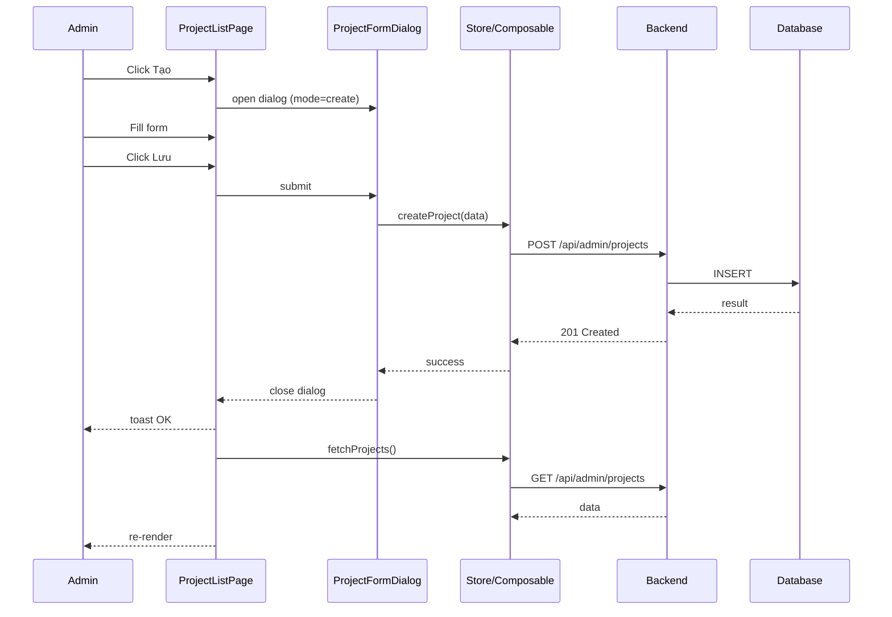
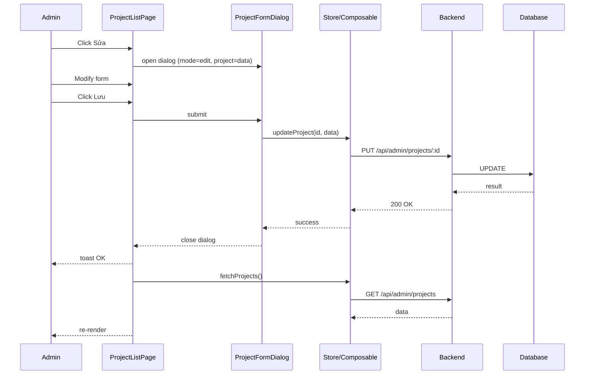
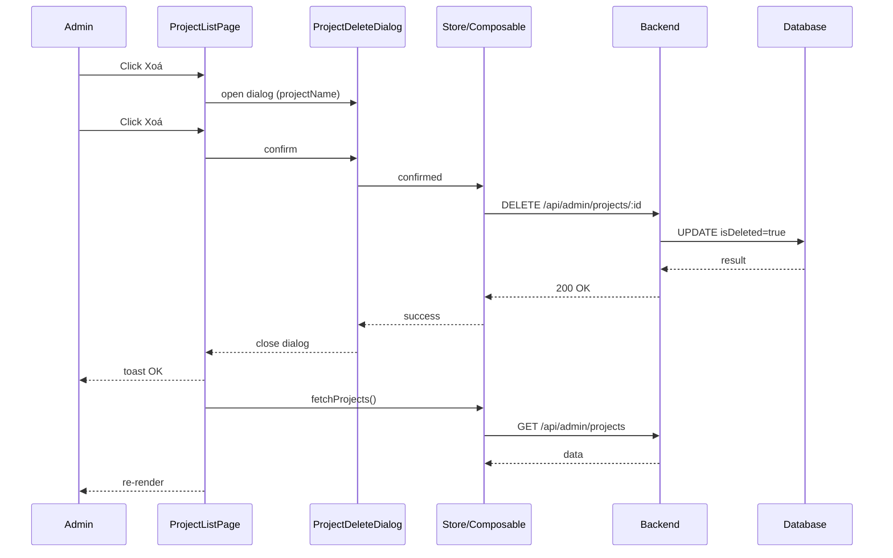
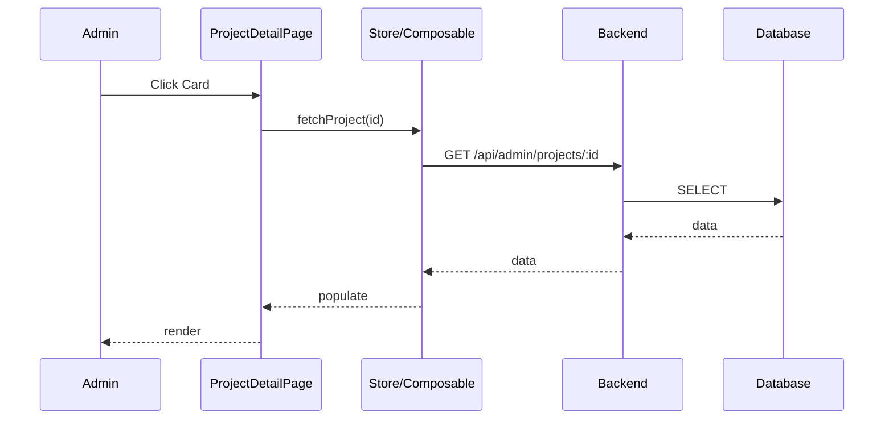

# Project Management — Behavior

> Related: [00-index.md](./00-index.md) | [01-backend.md](./01-backend.md) | [02-frontend.md](./02-frontend.md) | [04-quality.md](./04-quality.md)

---

## 1. Page Events & Handlers

### 1.1 ProjectListPage

#### onMounted
1. Gọi `projectsStore.fetchProjects()`
2. Render danh sách ProjectCard hoặc empty state

#### handleCardClick(id: number)
1. Điều hướng đến `ProjectDetailPage`: `router.push({ name: 'ProjectDetail', params: { id } })`

#### handleCreateClick()
1. Mở `ProjectFormDialog` với `mode='create'`, `project=null`

#### handleEditClick(id: number)
1. Tìm project trong store theo id
2. Mở `ProjectFormDialog` với `mode='edit'`, `project=foundProject`

#### handleDeleteClick(id: number)
1. Tìm project trong store theo id
2. Mở `ProjectDeleteDialog` với `projectName=project.name`
3. Nếu confirm → gọi `projectsStore.deleteProject(id)` → toast success → reload list
4. Nếu cancel → đóng dialog

#### handleFormSaved(data: CreateProjectDto | UpdateProjectDto)
1. Nếu `mode='create'`: gọi `projectsStore.createProject(data)` → toast success → đóng dialog → reload list
2. Nếu `mode='edit'`: gọi `projectsStore.updateProject(id, data)` → toast success → đóng dialog → reload list
3. Nếu lỗi: toast error, dialog vẫn mở

#### handleFormClosed()
1. Đóng dialog

---

### 1.2 ProjectDetailPage

#### onMounted
1. Lấy `id` từ `route.params.id` (parse to number)
2. Gọi `projectsStore.fetchProject(id)`
3. Nếu 404 → redirect về ProjectListPage + toast warning

#### onUnmounted
1. `projectsStore.clearCurrentProject()`

#### handleBackClick()
1. `router.push({ name: 'ProjectList' })`

---

## 2. UI States

### 2.1 Loading States

| Page / Component | Trigger | UI Behavior |
|-----------------|---------|-------------|
| ProjectListPage | `projectsStore.loading = true` | Hiển thị 3 skeleton cards |
| ProjectDetailPage | `projectsStore.loading = true` | Hiển thị form skeleton |
| ProjectFormDialog | Submitting form | Save button disabled + spinner |
| ProjectDeleteDialog | Deleting | Delete button disabled + spinner |

### 2.2 Empty States

| Page / Component | Condition | UI Behavior |
|-----------------|-----------|-------------|
| ProjectListPage | `projects.length === 0` && không loading | Hiển thị icon + message "Chưa có Project nào" + nút "Tạo Project" |

### 2.3 Error States

| Page / Component | Condition | UI Behavior |
|-----------------|-----------|-------------|
| ProjectListPage | Fetch projects fails | Toast error: "Không thể tải danh sách Project" |
| ProjectDetailPage | Project not found (404) | Redirect về list + toast: "Project không tồn tại" |
| ProjectFormDialog | Submit fails (server error) | Toast error: "Có lỗi xảy ra. Vui lòng thử lại." |
| Form field | Client validation fails | Highlight field đỏ + inline error message |

### 2.4 Success States

| Action | UI Behavior |
|--------|-------------|
| Create successful | Toast: "Tạo Project thành công" → đóng dialog → reload list |
| Update successful | Toast: "Cập nhật Project thành công" → đóng dialog → reload list |
| Delete successful | Toast: "Xoá Project thành công" → reload list |

---

## 3. Confirm Dialogs

### 3.1 Delete Confirmation

| Property | Value |
|----------|-------|
| Trigger | Click "Xoá" trong action menu trên ProjectCard |
| Title | "Xoá Project" |
| Message | "Bạn có chắc muốn xoá Project **{projectName}**?" |
| Confirm button | "Xoá" (severity: danger / red) |
| Cancel button | "Không" |
| On confirm | Gọi `deleteProject(id)` → toast → reload list |
| On cancel | Đóng dialog, không action |

---

## 4. Navigation Flows

| Action | From | To | Condition |
|--------|------|----|-----------|
| Click "Tạo Project" | ProjectListPage | Mở ProjectFormDialog (create) | Always |
| Click "Chỉnh sửa" | ProjectListPage | Mở ProjectFormDialog (edit) | Always |
| Click ProjectCard | ProjectListPage | ProjectDetailPage `/projects/:id` | Always |
| Click "Xoá" | ProjectListPage | Mở ProjectDeleteDialog | Always |
| Create success | ProjectFormDialog | ProjectListPage (reload) | After successful create |
| Update success | ProjectFormDialog | ProjectListPage (reload) | After successful update |
| Delete success | ProjectDeleteDialog | ProjectListPage (reload) | After successful delete |
| Click Back | ProjectDetailPage | ProjectListPage | Always |
| Project not found | ProjectDetailPage | ProjectListPage | API returns 404 |
| Unauthorized | Any page | Login page | 401 response |

---

## 5. Sequence Diagrams

### 5.1 Create Project Flow

### 5.2 Edit Project Flow

### 5.3 Delete Project Flow

### 5.4 View Project Detail Flow

