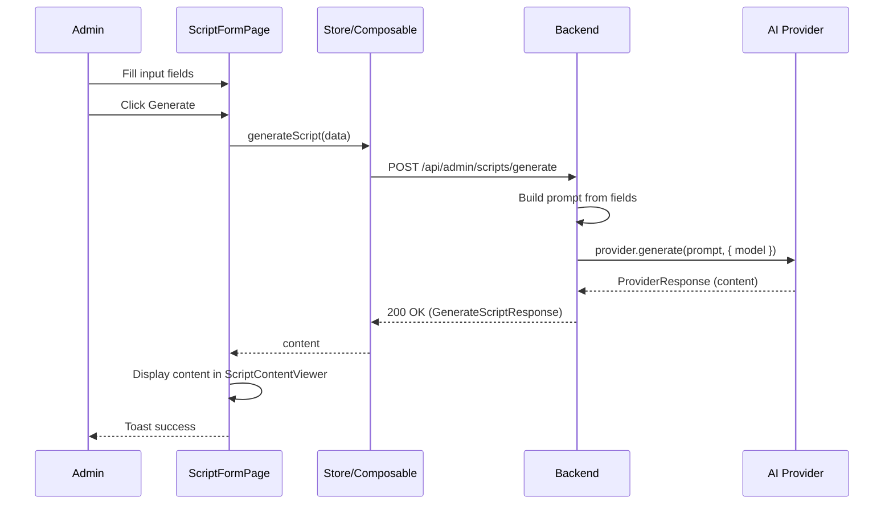
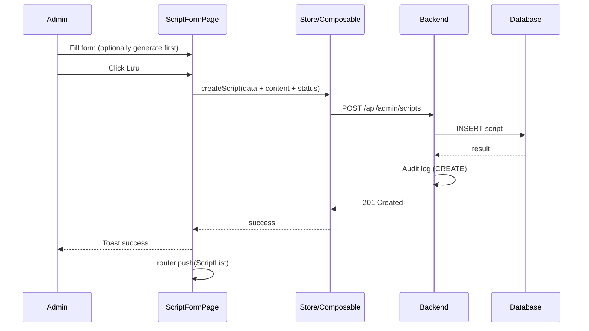
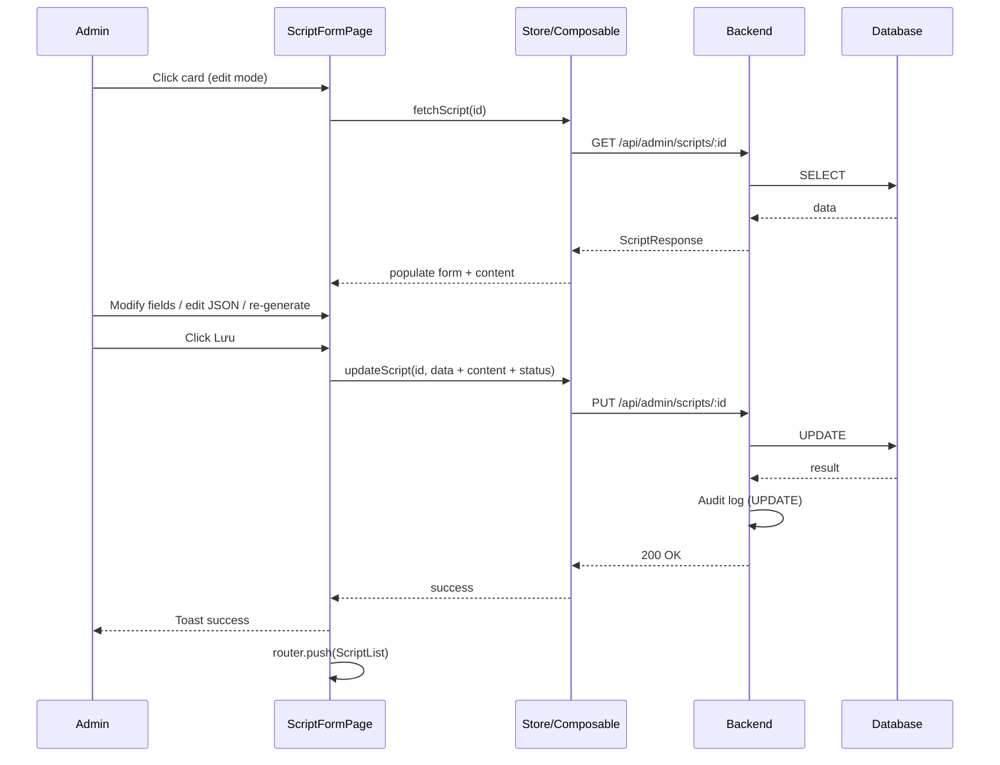
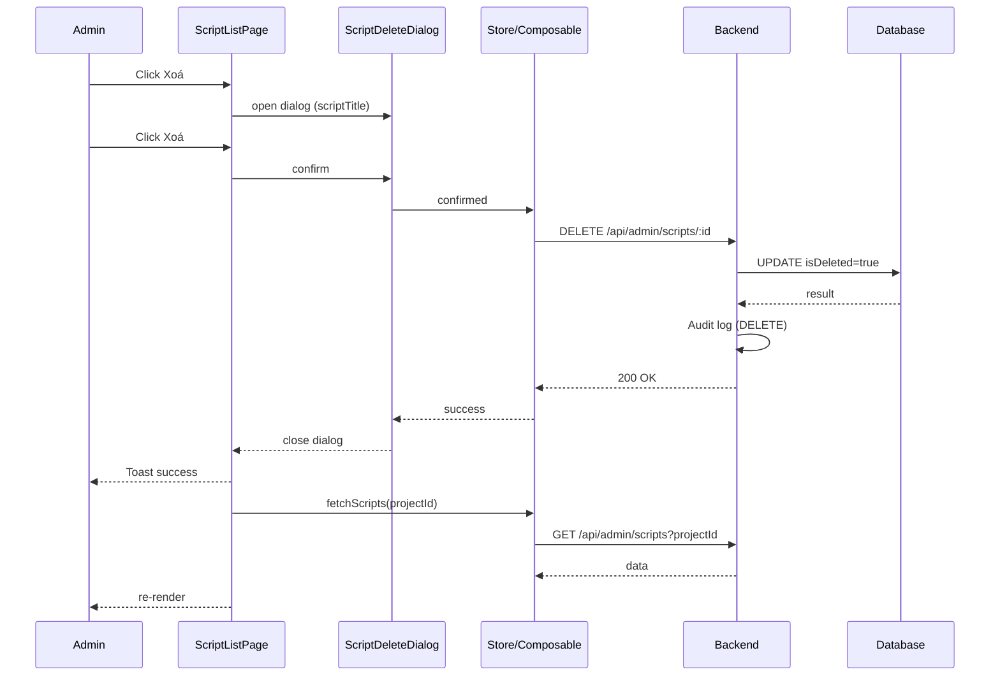
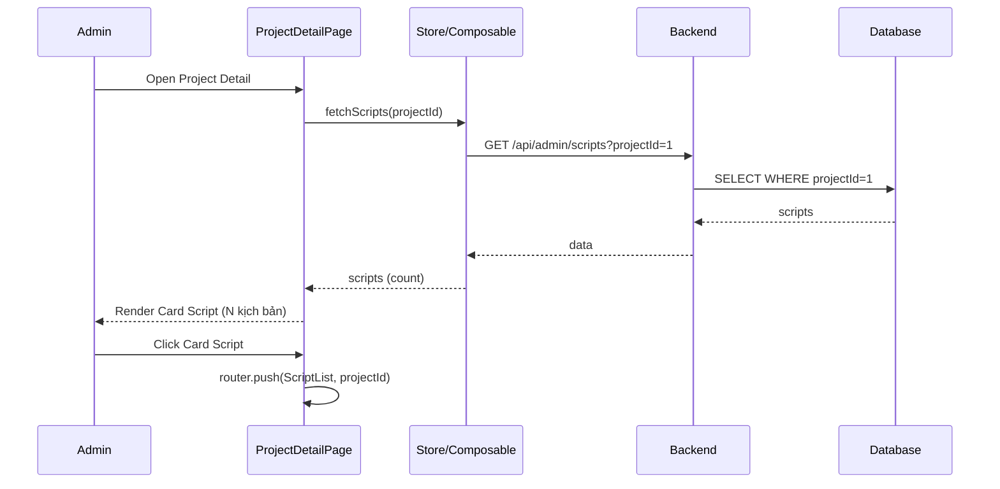

# Script Management — Behavior

> Related: [00-index.md](./00-index.md) | [01-backend.md](./01-backend.md) | [02-frontend.md](./02-frontend.md) | [04-quality.md](./04-quality.md)

---

## 1. Page Events & Handlers

### 1.1 ProjectDetailPage — Card Script section — [UPDATE - CR-SCRIPT-001]

#### onMounted (additional)
1. Sau khi fetch project detail, gọi `scriptsStore.fetchScripts(projectId)` để lấy danh sách scripts
2. Tính `scriptCount` từ `scriptsStore.scripts.length`
3. Render `ProjectScriptCard` với `projectId` và `scriptCount`

#### handleScriptCardClick(projectId: number)
1. Điều hướng đến ScriptListPage: `router.push({ name: 'ScriptList', params: { projectId } })`

---

### 1.2 ScriptListPage

#### onMounted
1. Lấy `projectId` từ `route.params.projectId` (parse to number)
2. Gọi `scriptsStore.fetchScripts(projectId)`
3. Render danh sách ScriptCard hoặc empty state

#### handleBackClick()
1. `router.push({ name: 'ProjectDetail', params: { id: projectId } })`

#### handleCreateClick()
1. Điều hướng đến ScriptFormPage (create): `router.push({ name: 'ScriptCreate', params: { projectId } })`

#### handleCardClick(id: number)
1. Điều hướng đến ScriptFormPage (edit): `router.push({ name: 'ScriptEdit', params: { projectId, scriptId: id } })`

#### handleEditClick(id: number)
1. Điều hướng đến ScriptFormPage (edit): `router.push({ name: 'ScriptEdit', params: { projectId, scriptId: id } })`

#### handleDeleteClick(id: number)
1. Tìm script trong store theo id
2. Mở `ScriptDeleteDialog` với `scriptTitle=script.title`
3. Nếu confirm → gọi `scriptsStore.deleteScript(id)` → toast success → reload list
4. Nếu cancel → đóng dialog

#### handleDeleteConfirmed()
1. Gọi `scriptsStore.deleteScript(selectedScriptId)`
2. Toast success: "Xoá kịch bản thành công"
3. Reload list: `scriptsStore.fetchScripts(projectId)`
4. Đóng dialog

---

### 1.3 ScriptFormPage

#### onMounted
1. Lấy `projectId` từ `route.params.projectId`
2. Gọi `scriptsStore.fetchAiModels()` để populate AI Model dropdown
3. Nếu route có `scriptId` (edit mode):
   a. Gọi `scriptsStore.fetchScript(scriptId)`
   b. Populate form với `currentScript` data
   c. Populate `ScriptContentViewer` với `currentScript.content`
4. Nếu không có `scriptId` (create mode):
   a. Khởi tạo form rỗng
   b. `ScriptContentViewer` hiển thị empty state

#### handleGenerate(data: GenerateScriptDto)
1. Set `generating = true`
2. Gọi `scriptsStore.generateScript(data)`
3. On success:
   a. Set `ScriptContentViewer.content` = response content
   b. Toast success: "Generate kịch bản thành công"
4. On error:
   a. Toast error: "Generate thất bại. Vui lòng thử lại."
5. Set `generating = false`

#### handleSave(payload: { data: CreateScriptDto | UpdateProjectDto, content: string | null })
1. Validate form client-side
2. Nếu invalid: highlight error fields, stop
3. Nếu valid:
   a. Set `loading = true`
   b. Determine status: nếu `content` null/empty → `status = 'draft'`; nếu có content → `status = 'generated'`
   c. Nếu create mode: gọi `scriptsStore.createScript({ ...payload.data, content, status, projectId })`
   d. Nếu edit mode: gọi `scriptsStore.updateScript(scriptId, { ...payload.data, content, status })`
   e. On success: toast success → `router.push({ name: 'ScriptList', params: { projectId } })`
   f. On error: toast error, stay on page
   g. Set `loading = false`

#### handleCancel()
1. Check if form has unsaved changes (dirty state)
2. If dirty: show confirm dialog (see [Confirm Dialogs](#3-confirm-dialogs))
3. On confirm (or not dirty): `router.push({ name: 'ScriptList', params: { projectId } })`

#### handleContentChange(content: string)
1. Update local content state (chưa save — chỉ save khi click Lưu)

#### onUnmounted
1. `scriptsStore.clearCurrentScript()`

---

## 2. UI States

### 2.1 Loading States

| Page / Component | Trigger | UI Behavior |
|-----------------|---------|-------------|
| ScriptListPage | `scriptsStore.loading = true` | Hiển thị 3 skeleton cards |
| ScriptFormPage (edit) | `scriptsStore.loading = true` (fetching script) | Hiển thị form skeleton |
| ScriptFormPage | `scriptsStore.loading = true` (submitting) | Save button disabled + spinner |
| ScriptFormPage | `scriptsStore.generating = true` | Generate button disabled + spinner; ScriptContentViewer hiển thị skeleton |
| ScriptDeleteDialog | Deleting | Delete button disabled + spinner |

### 2.2 Empty States

| Page / Component | Condition | UI Behavior |
|-----------------|-----------|-------------|
| ScriptListPage | `scripts.length === 0` && không loading | Hiển thị icon + message "Chưa có kịch bản nào" + nút "Tạo kịch bản" |
| ScriptContentViewer | `content` null/empty && không generating | Hiển thị "Chưa có nội dung. Click Generate để tạo." |
| ProjectScriptCard | `scriptCount === 0` | Hiển thị "0 kịch bản" + "Xem tất cả" vẫn clickable |

### 2.3 Error States

| Page / Component | Condition | UI Behavior |
|-----------------|-----------|-------------|
| ScriptListPage | Fetch scripts fails | Toast error: "Không thể tải danh sách kịch bản" |
| ScriptFormPage (edit) | Script not found (404) | Redirect về ScriptList + toast: "Kịch bản không tồn tại" |
| ScriptFormPage | Generate fails | Toast error: "Generate thất bại. Vui lòng thử lại." |
| ScriptFormPage | Save fails (server error) | Toast error: "Có lỗi xảy ra. Vui lòng thử lại." |
| ScriptFormPage | AI Model list fetch fails | Dropdown AI Model rỗng + warning: "Không tải được danh sách AI Model" |
| Form field | Client validation fails | Highlight field đỏ + inline error message |

### 2.4 Success States

| Action | UI Behavior |
|--------|-------------|
| Generate successful | Toast: "Generate kịch bản thành công" → content hiển thị bên phải |
| Create successful | Toast: "Tạo kịch bản thành công" → redirect ScriptList |
| Update successful | Toast: "Cập nhật kịch bản thành công" → redirect ScriptList |
| Delete successful | Toast: "Xoá kịch bản thành công" → reload list |

---

## 3. Confirm Dialogs

### 3.1 Delete Confirmation

| Property | Value |
|----------|-------|
| Trigger | Click "Xoá" trong action menu trên ScriptCard |
| Title | "Xoá kịch bản" |
| Message | "Bạn có chắc muốn xoá kịch bản **{scriptTitle}**?" |
| Confirm button | "Xoá" (severity: danger / red) |
| Cancel button | "Không" |
| On confirm | Gọi `deleteScript(id)` → toast → reload list |
| On cancel | Đóng dialog, không action |

### 3.2 Unsaved Changes Confirmation

| Property | Value |
|----------|-------|
| Trigger | Click Cancel / navigate away khi form dirty |
| Title | "Thay đổi chưa lưu" |
| Message | "Bạn có thay đổi chưa lưu. Có chắc muốn rời đi?" |
| Confirm button | "Rời đi" |
| Cancel button | "Ở lại" |
| On confirm | Navigate away without saving |
| On cancel | Đóng dialog, stay on page |

---

## 4. Navigation Flows

| Action | From | To | Condition |
|--------|------|----|-----------|
| Click Card Script | ProjectDetailPage | ScriptListPage `/projects/:projectId/scripts` | Always |
| Click "Tạo kịch bản" | ScriptListPage | ScriptFormPage (create) `/projects/:projectId/scripts/create` | Always |
| Click ScriptCard | ScriptListPage | ScriptFormPage (edit) `/projects/:projectId/scripts/:scriptId/edit` | Always |
| Click "Chỉnh sửa" | ScriptListPage | ScriptFormPage (edit) | Always |
| Click "Xoá" | ScriptListPage | Mở ScriptDeleteDialog | Always |
| Generate success | ScriptFormPage | Stay (content hiển thị bên phải) | Always |
| Create success | ScriptFormPage | ScriptListPage | After successful save |
| Update success | ScriptFormPage | ScriptListPage | After successful save |
| Delete success | ScriptDeleteDialog | ScriptListPage (reload) | After successful delete |
| Click Back | ScriptListPage | ProjectDetailPage `/projects/:id` | Always |
| Click Cancel (clean form) | ScriptFormPage | ScriptListPage | No dirty state |
| Click Cancel (dirty form) | ScriptFormPage | ScriptListPage | After confirm dialog |
| Script not found | ScriptFormPage (edit) | ScriptListPage | API returns 404 |
| Unauthorized | Any page | Login page | 401 response |

---

## 5. Sequence Diagrams

### 5.1 Generate Script Flow

### 5.2 Create Script Flow

### 5.3 Edit Script Flow

### 5.4 Delete Script Flow

### 5.5 View Script List from Project Detail Flow

