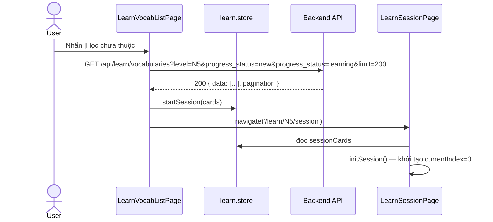
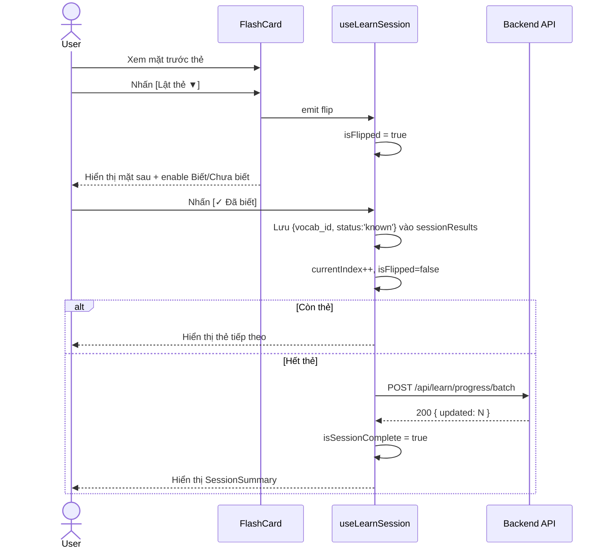
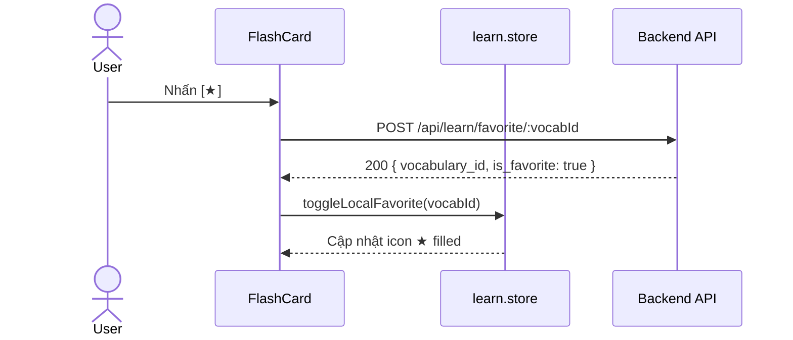

# 03 — Behavior: Vocabulary FlashCard

> Related: [00-index.md](./00-index.md) | [01-backend.md](./01-backend.md) | [02-frontend.md](./02-frontend.md) | [04-quality.md](./04-quality.md)

---

## 1. Page Events & Handlers

### 1.1 LearnLevelPage

| Event | Handler | Mô tả |
|-------|---------|-------|
| `onMounted` | `fetchLevelStats()` | Gọi `GET /api/learn/stats`, lưu vào store |
| `LevelCard @start` | `navigateToList(level)` | Navigate tới `/learn/:level/list` |

### 1.2 LearnVocabListPage

| Event | Handler | Mô tả |
|-------|---------|-------|
| `onMounted` | `fetchVocabList(level, filter)` | Gọi `GET /api/learn/vocabularies?level=...` |
| `LearnFilters @change` | `onFilterChange(filter)` | Cập nhật filter, reset page=1, reload list |
| `searchInput @input` | `onSearch(text)` | Debounce 300ms, reload list |
| `pagination @page` | `onPageChange(page)` | Reload list trang mới |
| `favoriteIcon @click` | `onToggleFavorite(vocabId)` | Gọi `POST /api/learn/favorite/:id`, cập nhật local |
| `studyAllBtn @click` | `startSession('all')` | Lấy toàn bộ từ ở level, lưu vào store, navigate `/session` |
| `studyUnknownBtn @click` | `startSession('unknown')` | Lấy từ có status `new` hoặc `learning`, navigate `/session` |
| `studySelectedBtn @click` | `startSession('selected')` | Dùng danh sách đã chọn, navigate `/session` |

**Ghi chú về `startSession`:**
- `'all'`: Fetch toàn bộ danh sách (không phân trang, max 200 từ) rồi lưu vào `learn.store.sessionCards`.
- `'unknown'`: Fetch với filter `progress_status=new&progress_status=learning` (max 200 từ).
- `'selected'`: Dùng trực tiếp danh sách checkbox đã chọn từ DataTable.
- Nếu danh sách rỗng → hiện toast warning "Không có từ nào để học".

### 1.3 LearnSessionPage

| Event | Handler | Mô tả |
|-------|---------|-------|
| `onMounted` | `initSession()` | Đọc `sessionCards` từ store; nếu rỗng → redirect về `/learn/:level/list` |
| `configButton @click` | `openConfigPanel()` | Mở `CardConfigPanel` |
| `FlashCard @flip` | `flipCard()` | Toggle `isFlipped = !isFlipped` |
| `FlashCard @toggleFavorite` | `onToggleFavorite(vocabId)` | Gọi API, cập nhật local, tăng `sessionResults.newFavoriteCount` nếu là lần đầu |
| `knownBtn @click` | `markKnown()` | Lưu kết quả `known` cho thẻ hiện tại, tăng knownCount, chuyển thẻ tiếp |
| `unknownBtn @click` | `markUnknown()` | Lưu kết quả `learning` cho thẻ hiện tại, tăng unknownCount, chuyển thẻ tiếp |
| `SessionSummary @retry` | `restartSession()` | Reset về thẻ đầu, xóa kết quả cũ |
| `SessionSummary @backToList` | `navigateToList()` | Navigate tới `/learn/:level/list` |

**Logic chuyển thẻ:**
1. `currentIndex++`
2. Nếu `currentIndex >= cards.length` → gọi `finishSession()`
3. `finishSession()`: gọi `POST /api/learn/progress/batch` với toàn bộ kết quả phiên, set `isSessionComplete = true`

---

## 2. UI States

### 2.1 LearnLevelPage

| State | Điều kiện | UI |
|-------|-----------|---|
| Loading | `levelStatsLoading = true` | Skeleton cho 5 LevelCard |
| Success | `levelStats.length > 0` | Hiển thị 5 LevelCard với stats |
| Error | API lỗi | Toast error + nút Thử lại |

### 2.2 LearnVocabListPage

| State | Điều kiện | UI |
|-------|-----------|---|
| Loading | `vocabListLoading = true` | DataTable skeleton (PrimeVue) |
| Empty — chưa có dữ liệu | `vocabList.length === 0 && filter.progressStatus = 'all'` | Illustration + "Chưa có từ vựng nào ở level này" |
| Empty — filter không có kết quả | `vocabList.length === 0 && filter != 'all'` | "Không có từ nào khớp bộ lọc" |
| Success | `vocabList.length > 0` | DataTable đầy đủ |
| Error | API lỗi | Toast error |

### 2.3 LearnSessionPage

| State | Điều kiện | UI |
|-------|-----------|---|
| No session | `sessionCards.length === 0` | Tự động redirect, không render |
| In progress — chưa lật | `isFlipped = false` | Mặt trước thẻ + nút Lật; knownBtn/unknownBtn disabled |
| In progress — đã lật | `isFlipped = true` | Mặt sau thẻ + knownBtn/unknownBtn enabled |
| Saving | `isSaving = true` (gọi batch API) | Overlay spinner nhẹ trên nút |
| Complete | `isSessionComplete = true` | Hiển thị `SessionSummary` |
| Save error | Batch API lỗi | Toast error + nút Thử lưu lại |

**Quan trọng:** Nút `[✓ Đã biết]` và `[✗ Chưa biết]` chỉ enable sau khi User đã lật thẻ (`isFlipped = true`).

---

## 3. Confirm Dialogs

| Dialog | Trigger | Tiêu đề | Nội dung | Nút | Kết quả |
|--------|---------|---------|---------|-----|---------|
| Thoát phiên học | User nhấn Back hoặc navigate ra ngoài khi đang học | "Thoát phiên học?" | "Tiến độ phiên này sẽ không được lưu. Bạn có chắc muốn thoát không?" | [Thoát] / [Ở lại] | [Thoát] → navigate; [Ở lại] → dismiss |

> Implement bằng `onBeforeRouteLeave` guard trong `LearnSessionPage` — chỉ kích hoạt khi `!isSessionComplete && currentIndex > 0`.

---

## 4. Navigation Flows

| Hành động | Từ | Đến | Điều kiện |
|-----------|-----|-----|-----------|
| Nhấn [Bắt đầu] trên LevelCard | `/learn` | `/learn/:level/list` | — |
| Nhấn [Học tất cả/chưa thuộc/đã chọn] | `/learn/:level/list` | `/learn/:level/session` | `sessionCards.length > 0` |
| Nhấn [Về danh sách] trong SessionSummary | `/learn/:level/session` | `/learn/:level/list` | `isSessionComplete = true` |
| Nhấn [Học lại] trong SessionSummary | `/learn/:level/session` | `/learn/:level/session` | Restart, không navigate |
| Xác nhận Thoát phiên học | `/learn/:level/session` | `/learn/:level/list` | Dialog confirm |
| Hủy Thoát | `/learn/:level/session` | — (ở lại) | — |
| User chưa đăng nhập | Bất kỳ `/learn/*` | `/login` | Auth guard |
| User không có role `user` | Bất kỳ `/learn/*` | `/403` hoặc `/dashboard` | Role guard |

---

## 5. Sequence Diagrams

### 5.1 Luồng Bắt đầu Phiên Học

### 5.2 Luồng Học Một Thẻ

### 5.3 Luồng Toggle Favorite

