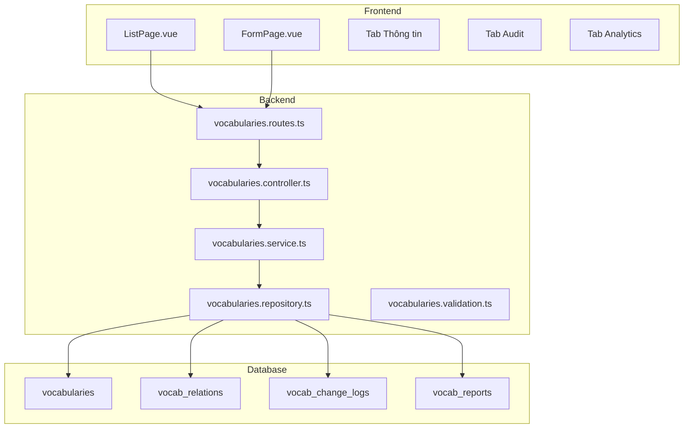

# Vocabulary Management — Design Specification

> Related: [01-backend.md](./01-backend.md) | [02-frontend.md](./02-frontend.md) | [03-behavior.md](./03-behavior.md) | [04-quality.md](./04-quality.md)

---

## 1. Executive Summary

Tính năng **Vocabulary Management** cho phép Admin quản lý toàn bộ từ vựng tiếng Nhật trong hệ thống: tạo, chỉnh sửa, xem danh sách, kiểm tra lịch sử thay đổi, báo cáo và phân tích sử dụng.

---

## 2. Changelog

| Version | Date | Author | Changes |
|---------|------|--------|---------|
| 1.0 | 2026-06-11 | Admin | Initial spec creation |

---

## 3. Objective & Scope

### Purpose

Cung cấp giao diện quản lý từ vựng tiếng Nhật cho Admin, bao gồm danh sách từ vựng, form tạo/chỉnh sửa với 3 tab (Thông tin, Audit, Analytics), và các tính năng filter, phân trang.

### In Scope

- Page List: hiển thị danh sách từ vựng với filter và phân trang
- Page Create/Edit: form 3 tab (Thông tin, Audit, Analytics)
- Backend API: CRUD, filter, pagination, validation
- Database: 5 bảng (vocabularies, vocab_relations, vocab_change_logs, vocab_reports, tags JSON)
- Quan hệ từ vựng: từ liên quan, đồng nghĩa, trái nghĩa (self-referencing)
- Báo cáo từ user (vocab_reports)
- Thống kê: learn count, favorite count (read-only)

### Out of Scope

- Frontend user-facing vocabulary display (đã có module khác)
- Multi-language translations (chỉ tiếng Việt + tiếng Nhật)
- Bulk import/export
- AI-assisted vocabulary creation
- Workflow chuyển đổi status (Draft → Publish)

---

## 4. Architecture Overview

---

## 5. Spec File Index

| File | Description | Owning Concern |
|------|-------------|----------------|
| [00-index.md](./00-index.md) | Executive summary, objective & scope, changelog, architecture | Overall design |
| [01-backend.md](./01-backend.md) | DB schema, API endpoints, validation rules, error handling | Backend |
| [02-frontend.md](./02-frontend.md) | Wireframes, component tree, screen specs, composable/store | Frontend |
| [03-behavior.md](./03-behavior.md) | Page events, UI states, confirm dialogs, navigation flows | Behavior |
| [04-quality.md](./04-quality.md) | Unit tests, integration tests, performance, security | Quality |
