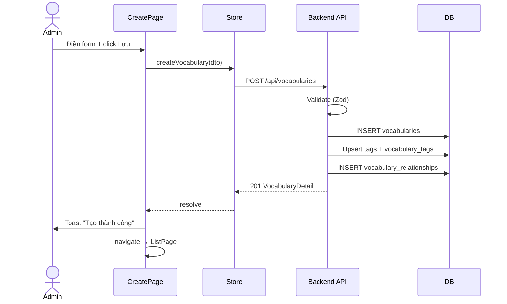
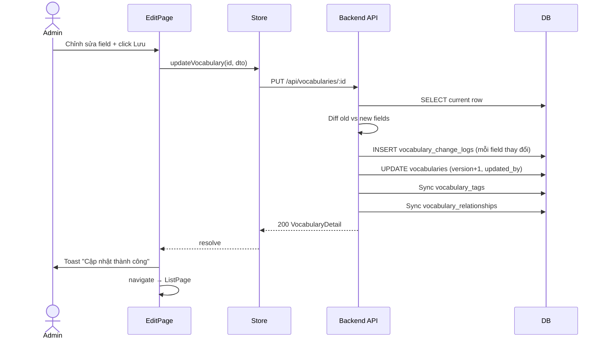
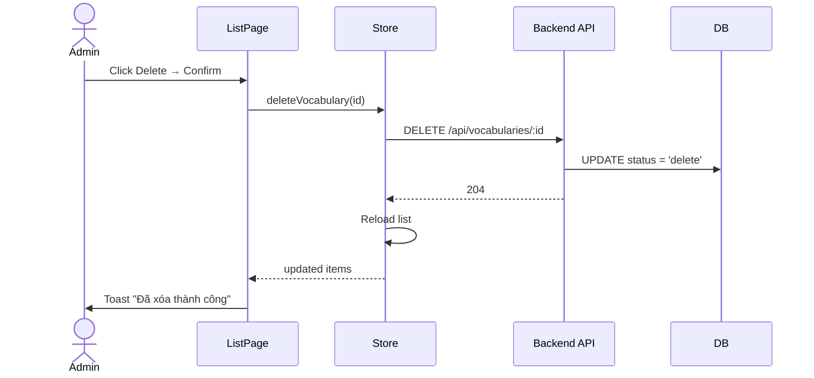
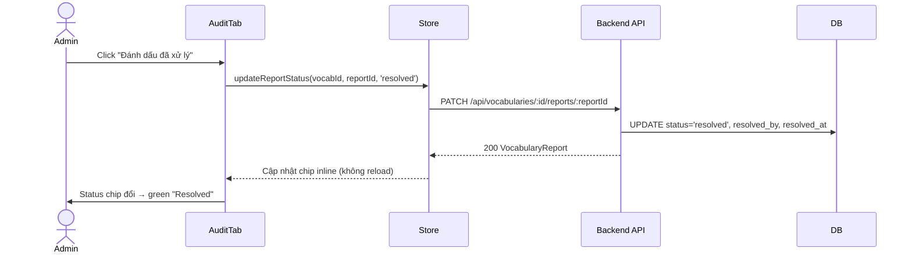

# 03 — Behavior: Vocabulary Management

> Related: [00-index.md](./00-index.md) | [01-backend.md](./01-backend.md) | [02-frontend.md](./02-frontend.md) | [04-quality.md](./04-quality.md)

---

## 1. Page Events & Handlers

### 1.1 VocabularyListPage

| Event | Handler | Mô tả |
|-------|---------|-------|
| `onMounted` | `store.fetchVocabularies()` | Tải danh sách ban đầu |
| Filter thay đổi (debounce 400ms) | `handleFilterChange(filters)` | Reset page=1, gọi `store.fetchVocabularies({ ...filters, page: 1 })` |
| Page thay đổi | `handlePageChange(page)` | Gọi `store.fetchVocabularies({ ...store.filters, page })` |
| Sort thay đổi | `handleSortChange(field, order)` | Gọi `store.fetchVocabularies({ ...store.filters, page: 1, sortBy: field, sortOrder })` |
| Click "Tạo từ vựng" | `router.push('VocabularyCreate')` | Điều hướng tới trang tạo mới |
| Click Edit | `router.push('VocabularyEdit', { id })` | Điều hướng tới trang chỉnh sửa |
| Click Delete | `handleDelete(id)` | Mở ConfirmDialog, xem Mục 3 |

### 1.2 VocabularyCreatePage

| Event | Handler | Mô tả |
|-------|---------|-------|
| `onMounted` | — | Không cần load data |
| Form submit | `handleSubmit(dto)` | Gọi `store.createVocabulary(dto)`, toast success → navigate về List |
| Submit error | — | Toast error với message từ API |
| Click Hủy | `handleCancel()` | Nếu form dirty → ConfirmDialog; ngược lại navigate về List |

### 1.3 VocabularyEditPage

| Event | Handler | Mô tả |
|-------|---------|-------|
| `onMounted` | `store.fetchVocabulary(id)` + `store.fetchChangeLogs(id)` + `store.fetchReports(id)` | Load đầy đủ dữ liệu |
| `onUnmounted` | `store.clearCurrent()` | Dọn state |
| Form submit | `handleSubmit(dto)` | Gọi `store.updateVocabulary(id, dto)`, toast success → navigate về List |
| Submit error | — | Toast error |
| Click Hủy | `handleCancel()` | Nếu form dirty → ConfirmDialog; ngược lại navigate về List |
| Resolve report | `handleResolveReport(reportId)` | Gọi `store.updateReportStatus(vocabId, reportId, 'resolved')`, cập nhật chip inline |
| Pending report | `handlePendingReport(reportId)` | Gọi `store.updateReportStatus(vocabId, reportId, 'pending')`, cập nhật chip inline |

### 1.4 VocabularyInfoTab

| Event | Handler | Mô tả |
|-------|---------|-------|
| Tag gõ (debounce 300ms) | `handleTagSearch(q)` | Gọi `composable.suggestTags(q)`, populate dropdown |
| Tag tạo mới | Tag thêm vào chips khi không có trong suggest | Không gọi API lúc này, create-on-save |
| MultiSelect gõ (debounce 300ms) | `handleWordSearch(q, type)` | Gọi `composable.searchVocabularies(q, currentId)`, populate options |
| MultiSelect chọn | Cập nhật `related_ids` / `synonym_ids` / `antonym_ids` | Emit `update:modelValue` |

---

## 2. UI States

### 2.1 VocabularyListPage

| State | Điều kiện | Hiển thị |
|-------|-----------|---------|
| Loading | `store.loading === true` | DataTable với skeleton rows |
| Empty | `store.items.length === 0 && !store.loading` | Empty state: icon + text `vocabularies.emptyList` + nút "Tạo từ vựng đầu tiên" |
| Empty (filter) | `store.items.length === 0 && có filter active` | Empty state: text `vocabularies.noResults` + nút "Xóa bộ lọc" |
| Error | `store.error !== null` | Toast error (tự dismiss sau 5s) |
| Normal | `store.items.length > 0` | DataTable với dữ liệu |

### 2.2 VocabularyCreatePage / EditPage

| State | Điều kiện | Hiển thị |
|-------|-----------|---------|
| Loading detail | `store.loadingDetail === true` | Skeleton form |
| Submitting | `submitting === true` | Nút "Lưu" disabled + loading spinner |
| Error fetch | `store.error !== null` | Toast error + nút "Thử lại" |
| Normal | Data loaded | Form hiển thị đầy đủ |

### 2.3 VocabularyAuditTab

| State | Điều kiện | Hiển thị |
|-------|-----------|---------|
| Loading logs | `store.loadingLogs === true` | Skeleton 3 rows trong Timeline |
| Loading reports | `store.loadingReports === true` | Skeleton DataTable |
| No logs | `changeLogs.length === 0` | Text `vocabularies.audit.noChanges` |
| No reports | `reports.length === 0` | Text `vocabularies.audit.noReports` |

---

## 3. Confirm Dialogs

### 3.1 Delete Vocabulary Dialog

| Thuộc tính | Giá trị |
|------------|---------|
| Trigger | Click nút Delete trên row |
| Title | `vocabularies.deleteHeader` |
| Message | `vocabularies.deleteConfirm` (ví dụ: "Bạn có chắc muốn xóa từ vựng này không?") |
| Icon | `pi pi-exclamation-triangle` |
| Accept button | `common.yes` — severity: `danger` |
| Reject button | `common.no` |
| Accept action | `store.deleteVocabulary(id)` → toast success → reload list |
| Reject action | Đóng dialog, không thay đổi |

### 3.2 Cancel Edit Dialog (khi form dirty)

| Thuộc tính | Giá trị |
|------------|---------|
| Trigger | Click "Hủy" khi form đã có thay đổi (`isDirty === true`) |
| Title | `common.unsavedChanges` |
| Message | `common.unsavedChangesConfirm` |
| Icon | `pi pi-exclamation-triangle` |
| Accept button | `common.discard` |
| Reject button | `common.keepEditing` |
| Accept action | Navigate về List mà không lưu |
| Reject action | Đóng dialog, ở lại trang |

---

## 4. Navigation Flows

| Hành động | Trang nguồn | Trang đích | Điều kiện |
|-----------|-------------|-----------|-----------|
| Click "+ Tạo từ vựng" | ListPage | CreatePage | Luôn luôn |
| Submit tạo mới thành công | CreatePage | ListPage | `store.createVocabulary` resolve |
| Click Hủy (form sạch) | CreatePage | ListPage | `isDirty === false` |
| Click Hủy (form dirty) → Confirm Discard | CreatePage | ListPage | User chọn "Bỏ thay đổi" |
| Click Edit trên row | ListPage | EditPage | Luôn luôn |
| Submit chỉnh sửa thành công | EditPage | ListPage | `store.updateVocabulary` resolve |
| Click Hủy (form sạch) | EditPage | ListPage | `isDirty === false` |
| Click Hủy (form dirty) → Confirm Discard | EditPage | ListPage | User chọn "Bỏ thay đổi" |
| Truy cập `/admin/vocabularies` không phải Admin | — | Login page | Route guard `requireRole('admin')` |

---

## 5. Sequence Diagrams

### 5.1 Tạo từ vựng mới

### 5.2 Cập nhật từ vựng

### 5.3 Xóa mềm từ vựng

### 5.4 Resolve báo cáo

