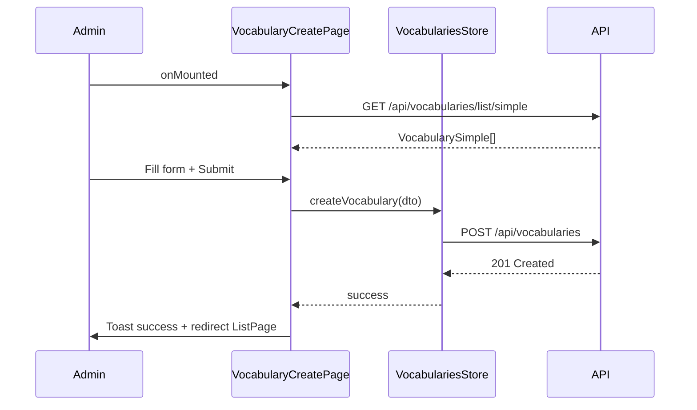
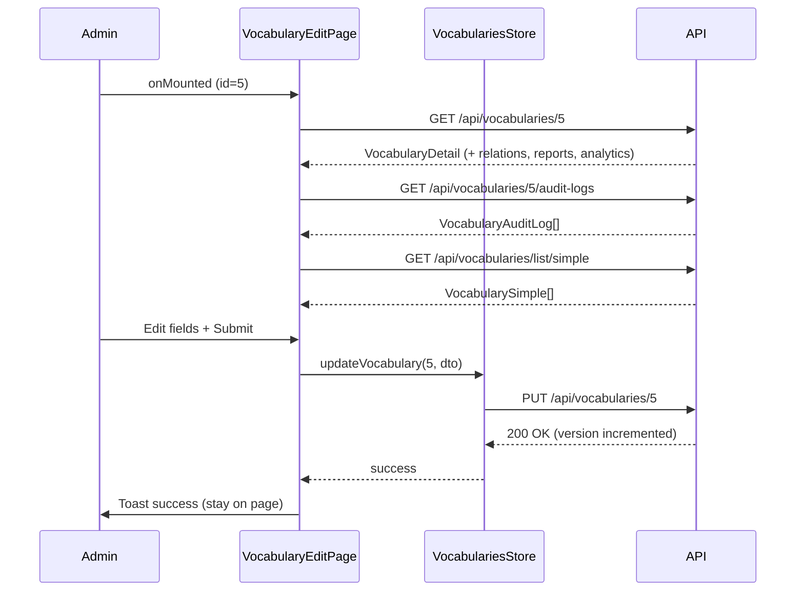
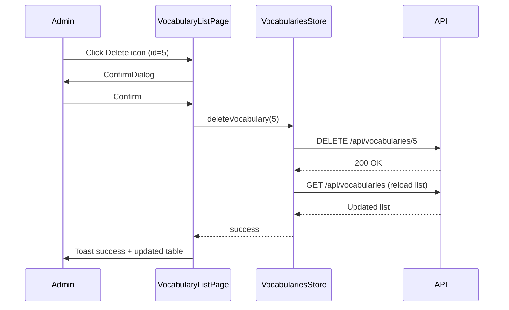
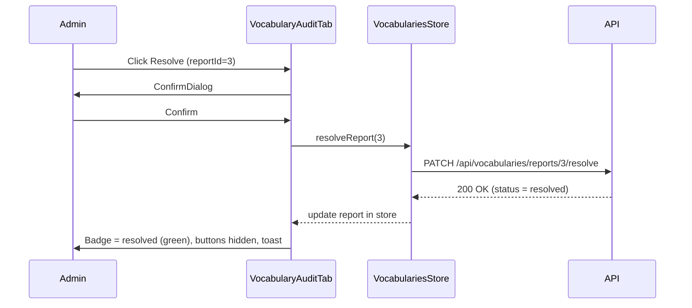

# Vocabulary Management — Behavior

> Related: [00-index.md](./00-index.md) | [01-backend.md](./01-backend.md) | [02-frontend.md](./02-frontend.md) | [04-quality.md](./04-quality.md)

---

## 1. Page Events & Handlers

### 1.1 VocabularyListPage

| Event | Handler | Description |
|-------|---------|-------------|
| `onMounted` | `fetchVocabularies()` | Load danh sách với bộ lọc mặc định |
| Filter change | `handleFilterChange(filters)` | Gọi `fetchVocabularies({ ...filters, page: 1 })` |
| Page change | `handlePageChange(page)` | Gọi `fetchVocabularies({ ...currentFilters, page })` |
| Sort change | `handleSortChange(field, order)` | Gọi `fetchVocabularies({ ...currentFilters, sortBy: field, sortOrder })` |
| Click Edit | `handleEdit(id)` | Navigate to `VocabularyEdit` route với params `{ id }` |
| Click Delete | `handleDelete(id)` | Mở ConfirmDialog xóa mềm |
| Click Create | — | Navigate to `VocabularyCreate` route |

---

### 1.2 VocabularyCreatePage

| Event | Handler | Description |
|-------|---------|-------------|
| `onMounted` | `fetchSimpleList()` | Load danh sách từ vựng đơn giản cho MultiSelect |
| Form submit | `handleSubmit(formData)` | POST tạo từ vựng; thành công → toast + redirect ListPage |
| Cancel | `handleCancel()` | Navigate về ListPage |

---

### 1.3 VocabularyEditPage

| Event | Handler | Description |
|-------|---------|-------------|
| `onMounted` | `fetchVocabulary(id)` | Load chi tiết từ vựng (bao gồm relations, reports, analytics) |
| `onMounted` | `fetchAuditLogs(id)` | Load audit logs |
| `onMounted` | `fetchSimpleList()` | Load simple list cho MultiSelect |
| `onUnmounted` | `clearCurrentVocabulary()` | Reset state |
| Form submit | `handleSubmit(formData)` | PUT cập nhật; thành công → toast, ở lại EditPage |
| Cancel | `handleCancel()` | Navigate về ListPage |
| Resolve report | `handleResolveReport(reportId)` | Mở ConfirmDialog → PATCH resolve |
| Reject report | `handleRejectReport(reportId)` | Mở ConfirmDialog → PATCH reject |

---

## 2. UI States

### 2.1 VocabularyListPage

| State | Điều kiện | Hiển thị |
|-------|-----------|---------|
| Loading | `loading = true` | Skeleton rows trong bảng (5 rows × 7 cols) |
| Empty | `loading = false && vocabularies.length === 0` | Empty state message + icon, link tạo từ vựng đầu tiên |
| Data | `loading = false && vocabularies.length > 0` | Bảng đầy đủ với paginator |
| Error | `error != null` | Toast error message |

---

### 2.2 VocabularyCreatePage / VocabularyEditPage

| State | Điều kiện | Hiển thị |
|-------|-----------|---------|
| Loading vocabulary (Edit) | `loadingVocabulary = true` | Skeleton cho toàn bộ form |
| Loading SimpleList | `loadingSimpleList = true` | MultiSelect disabled + spinner |
| Submitting | `submitting = true` | Save button disabled + spinner |
| Error submit | catch error | Toast error message |
| Tab 2 loading logs | `loadingLogs = true` | Skeleton list trong AuditTab |
| Tab 2 loading reports | `loadingReports = true` | Skeleton rows trong reports table |
| Tab 3 loading analytics | `loadingAnalytics = true` | Skeleton số liệu |

---

### 2.3 VocabularyAuditTab — Report States

| Status | Badge Color | Actions hiển thị |
|--------|------------|-----------------|
| `pending` | yellow/warning | Nút Resolve + Reject |
| `resolved` | green/success | Không có action |
| `rejected` | red/danger | Không có action |

---

## 3. Confirm Dialogs

### 3.1 Xóa từ vựng (soft-delete)

| Field | Value |
|-------|-------|
| **Trigger** | Click icon Delete trên hàng bảng |
| **Title** | `vocab.deleteHeader` |
| **Message** | `vocab.deleteConfirm` ("Bạn có chắc muốn xóa từ vựng này?") |
| **Accept button** | `common.yes` — style danger |
| **Reject button** | `common.no` |
| **On accept** | Gọi `deleteVocabulary(id)` → reload list → toast success |
| **On reject** | Đóng dialog, không làm gì |

---

### 3.2 Resolve report

| Field | Value |
|-------|-------|
| **Trigger** | Click nút Resolve trên row report |
| **Title** | `vocab.resolveReportHeader` |
| **Message** | `vocab.resolveReportConfirm` |
| **Accept button** | `common.confirm` |
| **Reject button** | `common.cancel` |
| **On accept** | Gọi `resolveReport(reportId)` → update report status in store → toast success |

---

### 3.3 Reject report

| Field | Value |
|-------|-------|
| **Trigger** | Click nút Reject trên row report |
| **Title** | `vocab.rejectReportHeader` |
| **Message** | `vocab.rejectReportConfirm` |
| **Accept button** | `common.confirm` — style danger |
| **Reject button** | `common.cancel` |
| **On accept** | Gọi `rejectReport(reportId)` → update report status in store → toast success |

---

## 4. Navigation Flows

| Action | From | To | Condition |
|--------|------|----|-----------|
| Click "Tạo từ vựng" | VocabularyListPage | VocabularyCreatePage | — |
| Click Edit icon | VocabularyListPage | VocabularyEditPage/:id | — |
| Submit create success | VocabularyCreatePage | VocabularyListPage | Response 201 |
| Submit create error | VocabularyCreatePage | VocabularyCreatePage (stay) | Response 4xx |
| Submit update success | VocabularyEditPage | VocabularyEditPage (stay) | Response 200, toast success |
| Submit update error | VocabularyEditPage | VocabularyEditPage (stay) | Response 4xx, toast error |
| Click Cancel | CreatePage / EditPage | VocabularyListPage | — |
| URL `/vocabularies` | — | VocabularyListPage | requiresAuth + role=admin |
| URL `/vocabularies/create` | — | VocabularyCreatePage | requiresAuth + role=admin |
| URL `/vocabularies/:id/edit` | — | VocabularyEditPage | requiresAuth + role=admin |

---

## 5. Sequence Diagrams

### 5.1 Tạo từ vựng mới

---

### 5.2 Cập nhật từ vựng

---

### 5.3 Xóa mềm từ vựng

---

### 5.4 Xử lý Report (Resolve)

