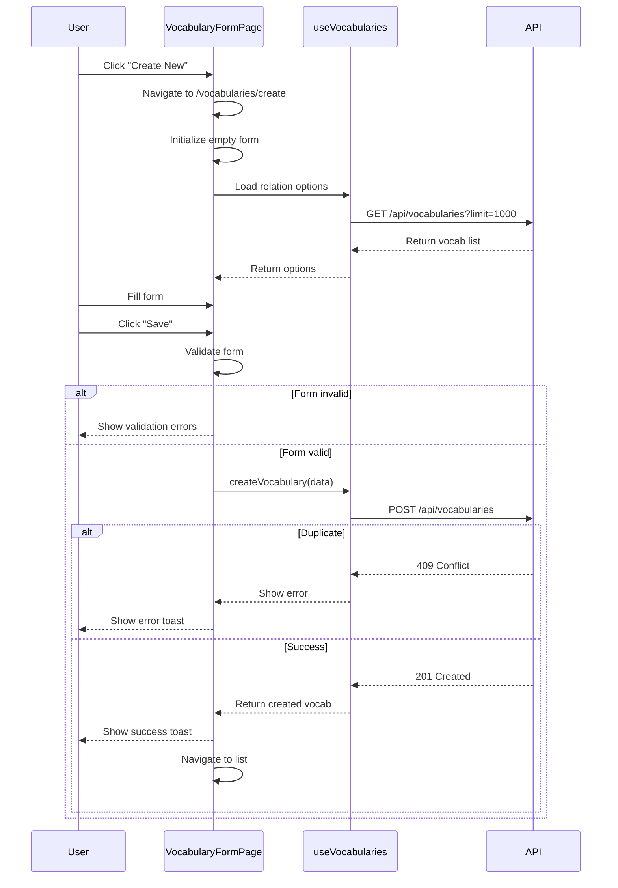
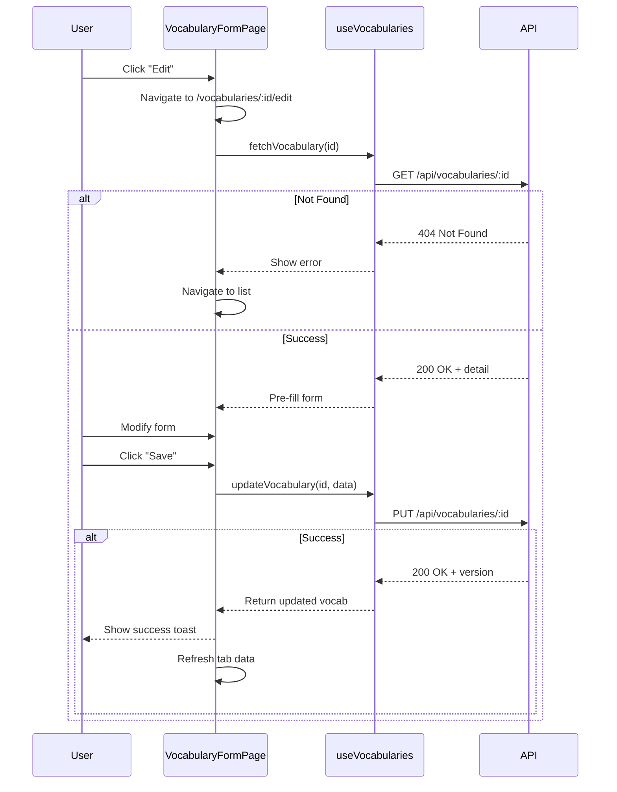
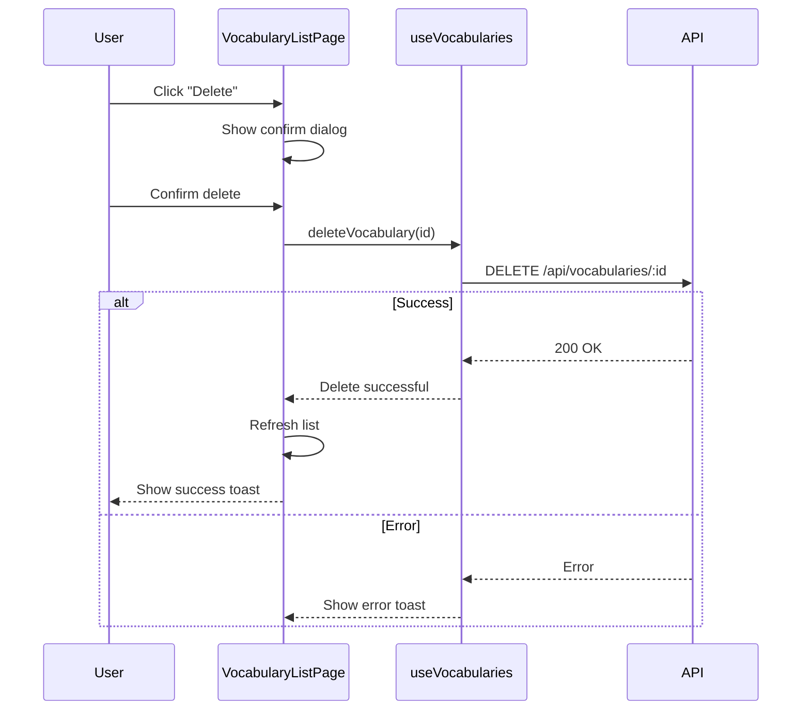
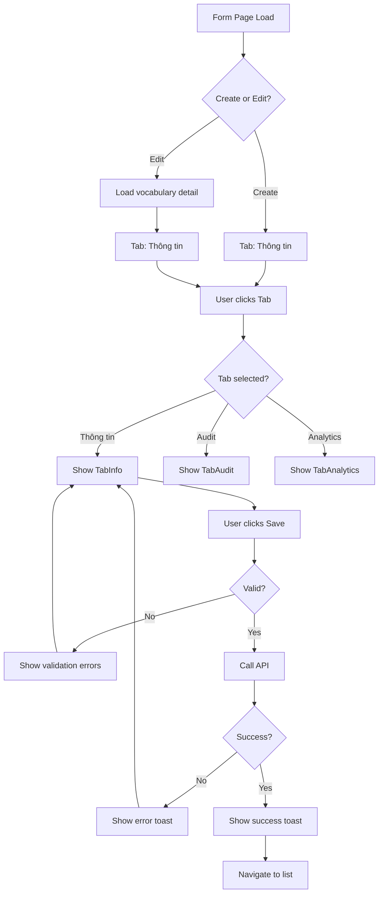

# Vocabulary Management — Behavior Specification

> Related: [00-index.md](./00-index.md) | [01-backend.md](./01-backend.md) | [02-frontend.md](./02-frontend.md) | [04-quality.md](./04-quality.md)

---

## 1. Page Events & Handlers

### 1.1 VocabularyListPage

| Event | Handler | Description |
|-------|---------|-------------|
| `onMounted` | `loadVocabularies()` | Load danh sách từ vựng với filters mặc định |
| Click "Create New" | `handleCreate()` | Navigate to `/vocabularies/create` |
| Click "Edit" | `handleEdit(id)` | Navigate to `/vocabularies/:id/edit` |
| Click "Delete" | `handleDelete(id)` | Show confirm dialog → call API → refresh list |
| Filter change | `handleFilterChange()` | Debounce 300ms → call `loadVocabularies()` |
| Click "Search" | `handleSearch()` | Apply filters |
| Click "Reset" | `handleReset()` | Clear filters → call `loadVocabularies()` |
| Pagination change | `handlePageChange(page)` | Load page mới |
| Sort change | `handleSort(field, order)` | Load sorted data |

**onMounted flow:**

1. Load filters từ URL query params (nếu có)
2. Call `fetchVocabularies(filters)`
3. Hiển thị data vào table

---

### 1.2 VocabularyFormPage — Tab Thông tin

| Event | Handler | Description |
|-------|---------|-------------|
| `onMounted` | `initializeForm()` | Load vocabulary data (nếu edit) hoặc init empty form |
| Form submit | `handleSubmit()` | Validate → call API → show success → navigate back |
| Click "Cancel" | `handleCancel()` | Show confirm dialog nếu form có changes → navigate back |
| Relation MultiSelect change | `handleRelationChange(type, ids)` | Update form state |
| Tags input change | `handleTagsChange(tags)` | Update tags array |
| Media URL blur | `validateMediaUrl()` | Validate URL format |

**onMounted flow (Create):**

1. Init empty form với default values (status = 'Publish')
2. Load relation options từ API
3. Switch to Tab "Thông tin"

**onMounted flow (Edit):**

1. Load vocabulary detail từ API `/api/vocabularies/:id`
2. Pre-fill form với data từ API
3. Load relations, change logs, reports
4. Switch to Tab "Thông tin"

---

### 1.3 VocabularyFormPage — Tab Audit

| Event | Handler | Description |
|-------|---------|-------------|
| Click "Resolve Report" | `handleResolveReport(reportId)` | Show confirm dialog → update report status → refresh data |

---

## 2. UI States

### 2.1 VocabularyListPage

| State | Condition | UI Behavior |
|-------|-----------|-------------|
| **Loading** | API call in progress | Show DataTable skeleton/spinner |
| **Empty** | No data returned | Show "No vocabulary found" message + "Create New" button |
| **Error** | API returns error | Show error message + "Retry" button |
| **Success** | Data loaded | Show table with data + pagination |

### 2.2 VocabularyFormPage

| State | Condition | UI Behavior |
|-------|-----------|-------------|
| **Loading** | API call in progress (edit mode) | Show full-page spinner |
| **Not Found** | Vocabulary 404 | Show error message + "Back to List" button |
| **Form Valid** | All required fields valid | Enable "Save" button |
| **Form Invalid** | Validation errors exist | Disable "Save" button + show error messages |
| **Saving** | API call in progress | Disable form + show spinner on Save button |
| **Success** | API returns 201/200 | Show success toast → navigate back |
| **Error** | API returns error | Show error toast with message |

### 2.3 Tab Analytics

| State | Condition | UI Behavior |
|-------|-----------|-------------|
| **Loading** | Analytics API call in progress | Show stat cards skeleton |
| **Success** | Data loaded | Show stat cards với số liệu |

---

## 3. Confirm Dialogs

| Dialog | Trigger | Title | Message | Buttons | Outcomes |
|--------|---------|-------|---------|---------|----------|
| Delete Confirm | Click "Delete" on list | `vocab.dialog.delete.title` | `vocab.dialog.delete.message` | "Hủy", "Xóa" | Hủy: đóng dialog | Xóa: call API → refresh list |
| Cancel Unsaved | Click "Cancel" với form có changes | `vocab.dialog.cancel.title` | `vocab.dialog.cancel.message` | "Hủy", "Đóng" | Hủy: ở lại form | Đóng: navigate back |
| Resolve Report | Click "Resolve" trên report | `vocab.dialog.resolve.title` | `vocab.dialog.resolve.message` | "Hủy", "Xử lý" | Hủy: đóng dialog | Xử lý: update status → refresh |

---

## 4. Navigation Flows

| Action | From | To | Condition |
|--------|------|----|-----------|
| Click "Create New" | VocabularyListPage | VocabularyFormPage (create) | Always |
| Click "Edit" | VocabularyListPage | VocabularyFormPage (edit) | Vocabulary exists |
| Click Kanji | VocabularyListPage | VocabularyFormPage (edit) | Always |
| Submit form success | VocabularyFormPage | VocabularyListPage | API 201/200 |
| Submit form error | VocabularyFormPage | VocabularyFormPage | API error — stay on page |
| Click Cancel | VocabularyFormPage | VocabularyListPage | No changes OR user confirms |
| Click "Back" | VocabularyFormPage | VocabularyListPage | Always |
| Click "Resolve Report" | TabAudit | TabAudit (same) | Report status updated |

---

## 5. Mermaid Diagrams

### 5.1 Create Vocabulary Flow

### 5.2 Edit Vocabulary Flow

### 5.3 Delete Vocabulary Flow

### 5.4 Tab Navigation Flow

